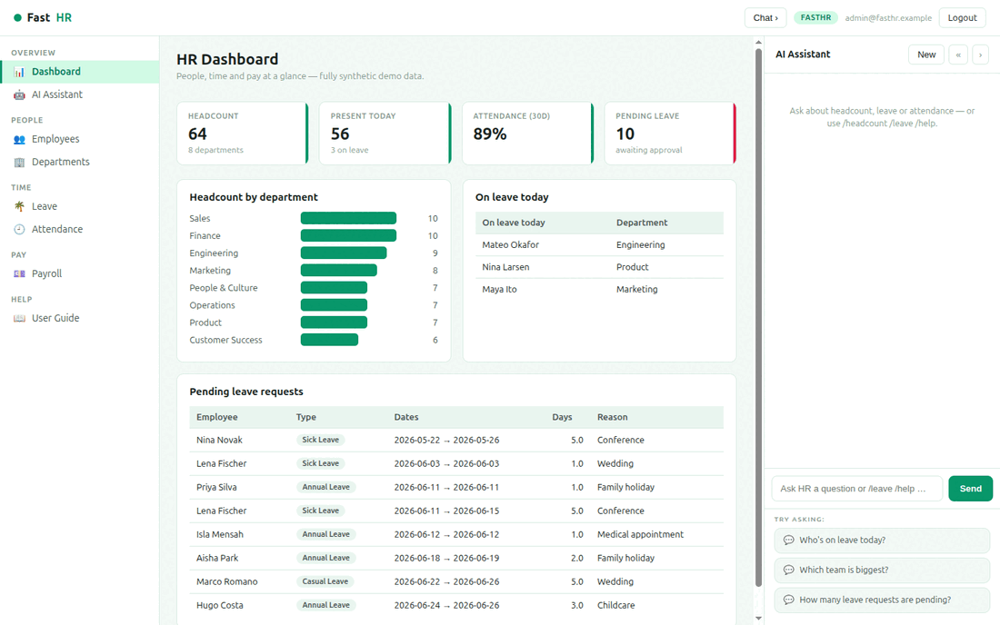

# FastHR

**FastHR** is an open-source **HR system** built with
[FastHTML](https://fastht.ml) — a server-side, HTMX-driven port of the core of
[Frappe HR (HRMS)](https://github.com/frappe/hrms), scoped to three pillars:
**people** (employee directory + departments), **time** (leave + attendance),
and **pay** (payslips). Python-first, no JavaScript framework, with an AI
assistant grounded in the live (synthetic) data.

*People ops, without the spreadsheets.* Runs on port **5010**.

> **Synthetic data only — no PII.** Everything runs on a deterministic, fully
> synthetic dataset generated by `seed.py`.

> Supersedes the earlier `fasthr` prototype with the shared
> `fasthtml-oss-migrations` template (SKILLS.md, Docker, demo GIF, AI assistant).

## Demo



## Quickstart (native)

```bash
python -m venv .venv
.venv/bin/python -m pip install -r requirements.txt
cp .env.sample .env          # add an LLM key for free-form AI chat
.venv/bin/python web_app.py  # http://localhost:5010  (self-seeds on first boot)
```

Login: `admin@fasthr.example` / `FastHR2026$`. Rebuild data with
`.venv/bin/python seed.py`.

## Run with Docker

```bash
docker compose up --build      # http://localhost:5010
```

`Dockerfile` (python:3.12-slim, port 5010) seeds on first boot;
`docker-compose.yml` mounts a `fasthr-data` volume at `/data`.

## Module tour

- **Dashboard** (`/`) — headcount, present-today, 30-day attendance rate,
  pending leave, headcount by department, on-leave-today, and a pending-requests
  worklist.
- **Employees** (`/employees`) — directory filtered by department and searchable;
  each profile shows **leave balances**, a colour-coded **attendance strip**, and
  **payslips**.
- **Departments** (`/departments`) — headcount, head, and annual payroll per dept.
- **Leave** (`/leave`) — requests by status (Pending / Approved / Rejected …).
- **Attendance** (`/attendance`) — today's register with a per-status breakdown.
- **Payroll** (`/payroll`) — payslips per period; each payslip has a full
  deductions breakdown.
- **AI Assistant** (right rail) — HR Q&A grounded in a live snapshot;
  slash-commands `/headcount`, `/leave`, `/today`, `/payroll` work with **no key**.

## Scope

Frappe HR is ~160 doctypes (full payroll engine, recruitment, performance,
onboarding, expenses, shifts…). FastHR ports the three pillars an HR team touches
daily; the rest is mapped in **[docs/ROADMAP.md](docs/ROADMAP.md)**.

## Architecture

```
web_app.py        routes, auth, SSE chat, boot
db.py             SQLite schema (people/time/pay) + read helpers
seed.py           deterministic synthetic org, leave, attendance, payroll
web/layout.py     3-pane shell, CSS, chat JS
web/views.py      dashboard, employees, leave, attendance, payroll renderers
web/ai.py         grounded chat + slash-commands
```

See **[SKILLS.md](SKILLS.md)** for the capability reference + migration playbook.
Part of the
[`fasthtml-oss-migrations`](https://github.com/predictivelabsai/fasthtml-oss-migrations)
initiative.

## Heritage

FastHRM consolidates the earlier **openhr** project (a pure-Python HR platform
explored for Nordic / EU public-sector deployments). Its reference architecture,
CBRE deck, diagrams and earlier implementation are preserved in
[`docs/openhr-reference/`](docs/openhr-reference/).

## Licence

MIT.
