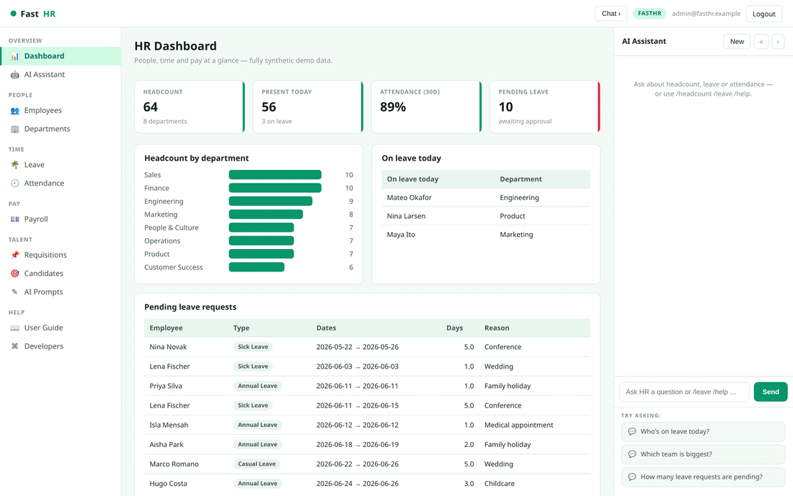

# FastHRM

**FastHRM** is an open-source **HR system** built with
[FastHTML](https://fastht.ml) — a server-side, HTMX-driven port of the core of
[Frappe HR (HRMS)](https://github.com/frappe/hrms), scoped to three pillars:
**people** (employee directory + departments), **time** (leave + attendance),
and **pay** (payslips). Python-first, no JavaScript framework, with an AI
assistant grounded in the live (synthetic) data.

*People ops, without the spreadsheets.* Runs on port **5010**.

> **Synthetic data only — no PII.** Everything runs on a deterministic, fully
> synthetic dataset generated by `seed.py`.

> Supersedes the earlier `fasthr` prototype with the shared
> `fasthtml-oss-migrations` template (SKILLS.md, Docker, demo GIF, AI assistant).

## Demo



**User guide** — [PDF](docs/fasthrm_user_guide_2026-08-08.pdf) ·
[PPTX](docs/fasthrm_user_guide_2026-08-08.pptx) ·
[markdown](docs/fasthrm_user_guide_2026-08-08.md). Screenshots live in
[`screenshots/`](screenshots/); regenerate everything with:

**Platform guide** — [PDF](docs/fasthrm_platform_guide_2026-08-08.pdf) ·
[PPTX](docs/fasthrm_platform_guide_2026-08-08.pptx) ·
[markdown](docs/fasthrm_platform_guide_2026-08-08.md).

```bash
DEMO_BASE_URL=http://localhost:5010 .venv/bin/python scripts/capture_guide_screenshots.py \
  --demo-frames docs/demo/frames
bash scripts/build_demo_gif.sh      # README walkthrough GIF
bash scripts/build_user_guide.sh    # PDF + PPTX
.venv/bin/python scripts/generate_api_docs.py  # swagger.json
.venv/bin/python scripts/build_pptx.py docs/fasthrm_platform_guide_2026-08-08.md \
  docs/fasthrm_platform_guide_2026-08-08.pptx "FastHRM Platform Guide"
```

## Quickstart (native)

```bash
python -m venv .venv
.venv/bin/python -m pip install -r requirements.txt
cp .env.sample .env          # add an LLM key for free-form AI chat
.venv/bin/python web_app.py  # http://localhost:5010  (self-seeds on first boot)
```

Login: `admin@fasthr.example` / `FastHR2026$`. Rebuild data with
`.venv/bin/python seed.py`.

## Run with Docker

```bash
docker compose up --build      # http://localhost:5010
```

`Dockerfile` (python:3.12-slim, port 5010) seeds on first boot;
`docker-compose.yml` mounts a `fasthr-data` volume at `/data`.

## Module tour

- **Dashboard** (`/`) — headcount, present-today, 30-day attendance rate,
  pending leave, headcount by department, on-leave-today, and a pending-requests
  worklist.
- **Employees** (`/employees`) — directory filtered by department and searchable;
  each profile shows **leave balances**, a colour-coded **attendance strip**, and
  **payslips**.
- **Departments** (`/departments`) — headcount, head, and annual payroll per dept.
- **Leave** (`/leave`) — requests by status (Pending / Approved / Rejected …).
- **Attendance** (`/attendance`) — today's register with a per-status breakdown.
- **Payroll** (`/payroll`) — payslips per period; each payslip has a full
  deductions breakdown.
- **Requisitions** (`/talent/jobs`) — open roles with a live pipeline: stage
  counts, applicant list, and one-click stage moves (every move audited).
- **Public careers** (`/careers`, `/jobs/<slug>`) — branded role sub-pages,
  application forms, consent capture, preview, publishing and scheduled closure.
- **Recruiting platform** (`/talent/platform`) — project workflows, recruiter
  tasks, talent CRM, communications and automation, self-scheduling, job-board
  connectors, campaigns, attribution analytics, multi-brand sites, SSO/SCIM,
  AI screening, video interviews, imports and service controls.
- **Candidates** (`/talent/candidates`) — talent pool with **AI CV extraction**:
  drop in a PDF/DOCX and the model returns a structured profile — identity,
  work history with normalised dates, education, and skills with evidence —
  persisted to the database, not just displayed.
- **Offers** (`/talent/offers`) — draft, approve, send. **Accepting an offer
  creates the employee record**: skills carry across from the parsed CV, leave is
  allocated, and the onboarding checklist starts itself.
- **Talent analytics** (`/talent/analytics`) — time-to-fill, source
  effectiveness, days-in-stage and interviewer load.
- **Goals & OKRs** (`/performance/goals`) — company → team → individual cascade
  with check-in history and an alignment tree.
- **Feedback** (`/performance/feedback`) — praise, coaching and peer review,
  tagged to competencies with per-entry visibility.
- **Review cycles** (`/performance/reviews`) — opening a cycle generates self and
  manager reviews for everyone; calibration grid and rating distribution.
- **Signals** (`/performance/signals`) — advisory attrition and promotion
  indicators. **Every flag lists the factors behind it** — no unexplained scores.
- **Lifecycle** (`/lifecycle/…`) — onboarding checklists, effective-dated
  promotions and transfers with approval, separations with exit interviews and
  alumni status, confidential employee-relations cases, and an org chart with
  what-if headcount costing.
- **Integrations** (`/settings/integrations`) — 13 providers (LinkedIn, Indeed,
  Greenhouse, Slack, calendars, DocuSign, screening, HRIS). API keys are
  **encrypted at rest** and shown only as the last four characters.
- **AI Prompts** (`/talent/prompts`) — the CV-extraction, ranking and offer-letter
  guidance, editable in plain English by a recruiter. Versioned and
  roll-backable; the JSON output contract lives in code, so an edit can never
  break the parser.
- **AI Assistant** (right rail) — HR Q&A grounded in a live snapshot;
  slash-commands `/headcount`, `/leave`, `/today`, `/payroll` work with **no key**.
- **Build identity** — the public footer and signed-in top bar show `v0.4.0 · <commit>`,
  linking to `/about` (build, environment, model, schema history). `/healthz`
  returns the same as JSON **without a login**, so you can confirm what a
  deployment is actually running.

> **Two things are deliberately unfinished and say so in the UI:** roles are
> assigned but **not yet enforced** at the query layer, and integration
> connectors store and test credentials but do **not** call their providers yet.
> See [docs/TALENT-PLATFORM-PLAN.md](docs/TALENT-PLATFORM-PLAN.md) §10.

## Scope

Frappe HR is ~160 doctypes (full payroll engine, recruitment, performance,
onboarding, expenses, shifts…). FastHRM ports the three pillars an HR team touches
daily, plus the ATS core; the rest is mapped in
**[docs/ROADMAP.md](docs/ROADMAP.md)**, and the plan to grow this into a full
Talent + Performance + Lifecycle platform is in
**[docs/TALENT-PLATFORM-PLAN.md](docs/TALENT-PLATFORM-PLAN.md)**.

## Architecture

```
web_app.py        routes, auth, SSE chat, boot
db.py             connection helpers, migration runner, people/time/pay reads
migrations/       numbered SQL, applied in order and recorded in a ledger
talent.py         ATS data layer — requisitions, candidates, interviews, offers, hire
recruitment.py    job authoring, careers publishing, applications and consent
recruiting_ops.py projects, workflows, talent CRM, forms, tasks and approvals
recruitment_communications.py mailboxes, templates, automation, portals and privacy
recruitment_ecosystem.py scheduling, connectors, campaigns and analytics
recruitment_enterprise.py brands, identity, AI screening, video, imports and SLAs
people.py         performance + lifecycle — goals, feedback, reviews, onboarding, exits
integrations.py   provider catalogue, encrypted credential store, connection tests
seed.py           deterministic synthetic org, leave, attendance, payroll
seed_talent.py    synthetic requisitions, candidates and pipeline (re-runnable)
seed_platform.py  synthetic interviews, offers, goals, feedback, lifecycle
web/layout.py     3-pane shell, CSS, chat JS
web/views.py      dashboard, employees, leave, attendance, payroll renderers
web/ats.py        requisitions, candidates, scorecards, offers, analytics
web/careers.py    public careers site, job sub-pages and application experience
web/recruiting_platform.py recruiter operations and enterprise control centre
web/performance.py goals, feedback, review cycles, signals
web/lifecycle.py  onboarding, changes, separations, cases, org chart
web/settings.py   integrations and roles
web/cv_extract.py CV → text → prompt + contract → structured profile
web/ranking.py    explainable shortlist ranking + offer-letter drafting
web/llm.py        Grok via the OpenAI-compatible LangChain client
web/ai.py         grounded chat + slash-commands
tests/            migrations, CV extraction, hire conversion, integrations (pytest)
```

### CV extraction

Upload a CV and it is stored, converted to text (pdfplumber / python-docx), and
sent to Grok with the active prompt plus a fixed output contract. The parse runs
on a background thread; the page polls until it lands. Every run records its
prompt version, model, latency and raw response in `extraction_runs`, so a bad
parse is diagnosable and a prompt change is measurable.

```bash
.venv/bin/python -m pytest tests/ -q          # stubbed model, no API calls
FASTHR_LIVE_LLM=1 .venv/bin/python -m pytest tests/ -q -k live   # real API
```

Set `MODEL_PROVIDER` (`xai` or `openai`), `MODEL_NAME` and the matching key in
`.env`. Without a key the ATS still works — extraction reports that it is
disabled rather than failing silently.

See **[SKILLS.md](SKILLS.md)** for the capability reference + migration playbook.
Part of the
[`fasthtml-oss-migrations`](https://github.com/predictivelabsai/fasthtml-oss-migrations)
initiative.

## Heritage

FastHRM consolidates the earlier **openhr** project (a pure-Python HR platform
explored for Nordic / EU public-sector deployments). Its reference architecture,
CBRE deck, diagrams and earlier implementation are preserved in
[`docs/openhr-reference/`](docs/openhr-reference/).

## Licence

MIT.
