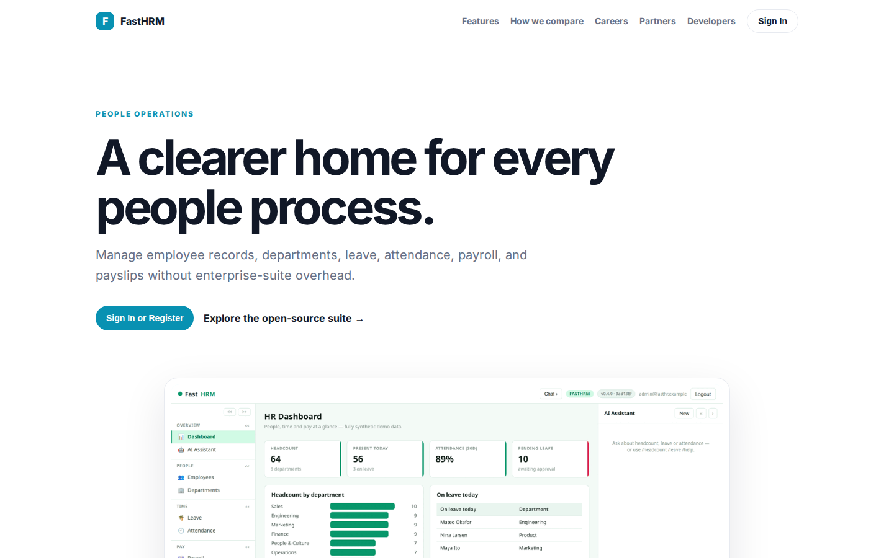
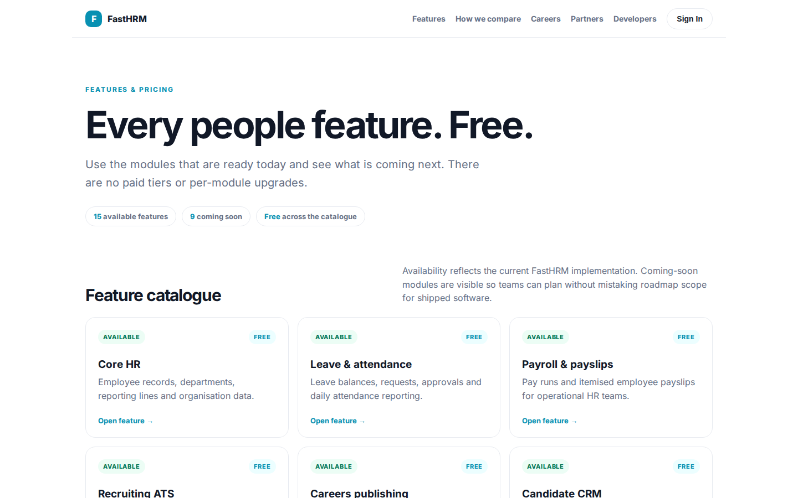
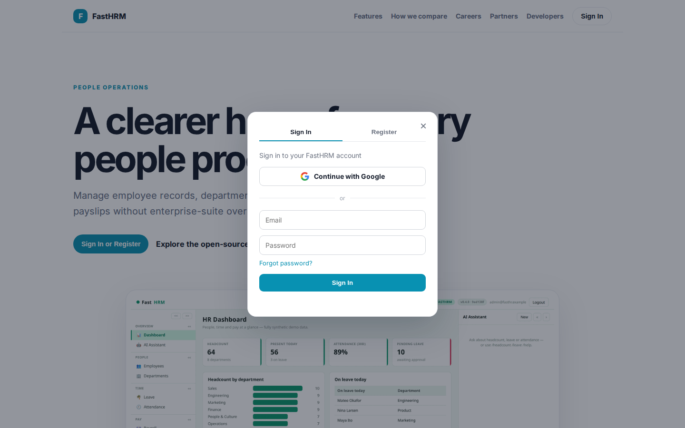
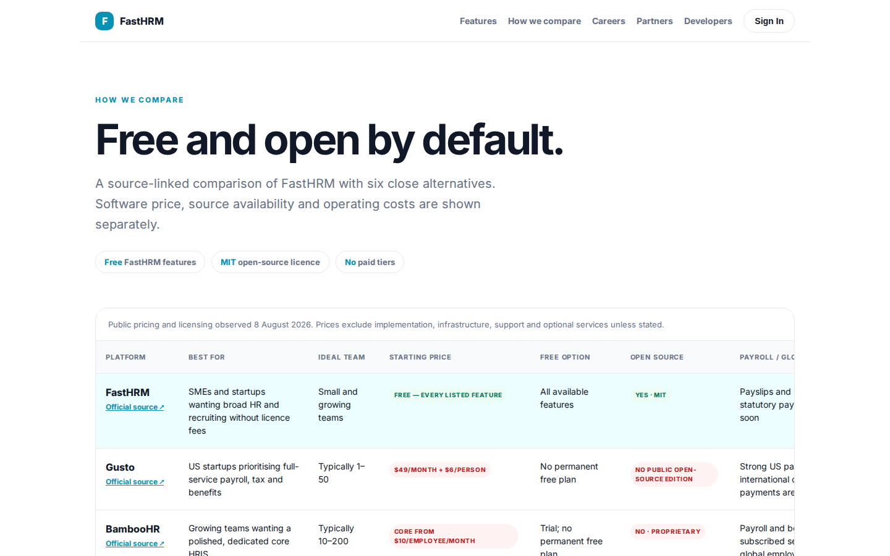

# FastHRM Platform Guide

**Published:** 2026-08-19
**Platform:** [https://hrm.fastsme.com](https://hrm.fastsme.com)
**Source:** [github.com/predictivelabsai/FastHRM](https://github.com/predictivelabsai/FastHRM)

## Platform overview

**FastHRM** is an open-source **HR system** built with — a server-side, HTMX-driven port of the core of , scoped to three pillars: **people** (employee directory + departments), **time** (leave + attendance), and **pay** (payslips). Python-first, no JavaScript framework, with an AI assistant grounded in the live (synth

This visual guide was reviewed against the live product using Playwright. Screens and available navigation can vary by account, role, and deployment configuration.

## 1. A clearer home for every people process.

PEOPLE OPERATIONS A clearer home for every people process. Manage employee records, departments, leave, attendance, payroll, and payslips without enterprise-suite overhead. Sign In or Register Explore the open-source suite → Product tour · people, time, pay, p

Screen reviewed at: [https://hrm.fastsme.com/](https://hrm.fastsme.com/)

## 2. Every people feature. Free.

FEATURES & PRICING Every people feature. Free. Use the modules that are ready today and see what is coming next. There are no paid tiers or per-module upgrades. 15 available features 9 coming soon Free across the catalogue Feature catalogue Availability reflec

Screen reviewed at: [https://hrm.fastsme.com/features](https://hrm.fastsme.com/features)

## 3. A clearer home for every people process.

PEOPLE OPERATIONS A clearer home for every people process. Manage employee records, departments, leave, attendance, payroll, and payslips without enterprise-suite overhead. Sign In or Register Explore the open-source suite → Product tour · people, time, pay, p

Screen reviewed at: [https://hrm.fastsme.com/login?next=%2F](https://hrm.fastsme.com/login?next=%2F)

## 4. Free and open by default.

HOW WE COMPARE Free and open by default. A source-linked comparison of FastHRM with six close alternatives. Software price, source availability and operating costs are shown separately. Free FastHRM features MIT open-source licence No paid tiers Public pricing

Screen reviewed at: [https://hrm.fastsme.com/compare](https://hrm.fastsme.com/compare)

## Getting started

Visit [https://hrm.fastsme.com](https://hrm.fastsme.com) to explore FastHRM. For source code and deployment details, use the GitHub link above.
