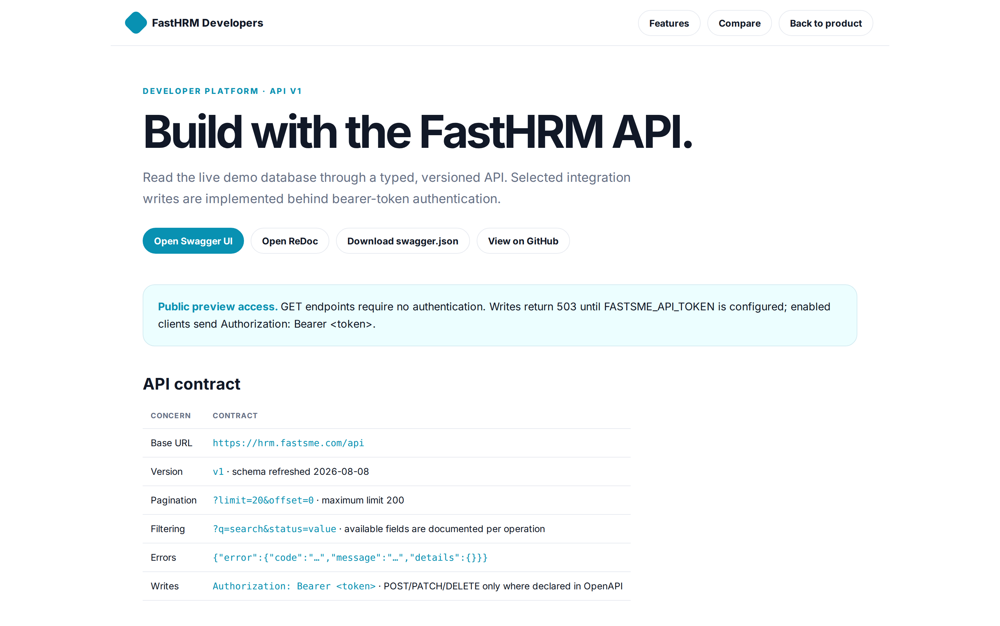
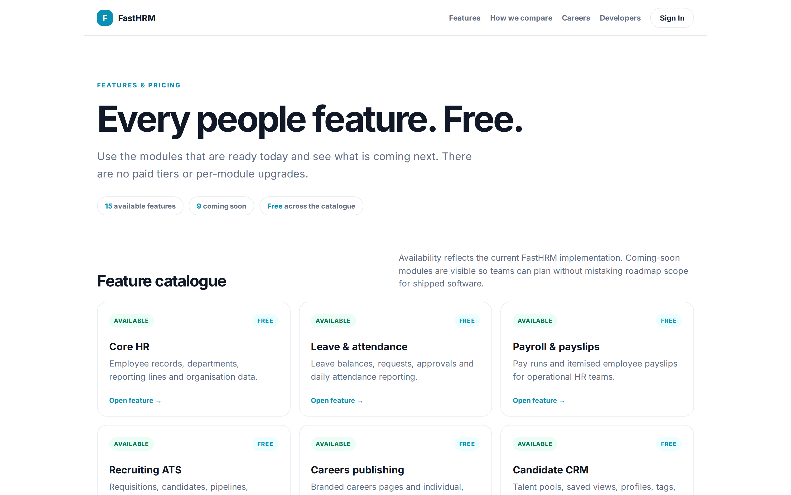

# FastHRM Platform Guide

::: cover

**People operations, recruiting, performance and lifecycle — in one open platform**

Product landscape · Free catalogue · 8 August 2026

---

## 01. One platform for the employee and candidate lifecycle

- **People operations** — employee records, departments, leave, attendance, pay and organisation data.
- **Recruiting** — publish job specifications, receive applications and run structured hiring workflows.
- **Performance** — align goals, collect feedback, run reviews and explain people signals.
- **Lifecycle** — coordinate onboarding, changes, separations, cases and workforce scenarios.
- **Platform** — public API, enterprise controls, analytics and AI-assisted work in the same Python application.

---

## 02. FastHRM at a glance

| Measure | Current platform |
|---|---|
| Product pricing | **Free across every available and coming-soon module** |
| Available products | **15** |
| Coming-soon products | **9** |
| API resources | **12 versioned resources** |
| Public experiences | Landing · feature catalogue · comparison · careers · job pages · candidate flows · developer docs |
| Delivery model | Open-source, self-hostable FastHTML application |
| Data model | SQLite with five ordered, additive migrations |
| Quality gate | Automated pytest suite plus Playwright browser verification |

---

## 03. The platform is organised around four operating layers

| Layer | Core capabilities | Primary users | Outcome |
|---|---|---|---|
| People system | Employees · departments · leave · attendance · payroll | HR operations · employees | Reliable people records and daily workflows |
| Talent system | Careers · ATS · CRM · scheduling · communications | Recruiters · hiring managers | Faster, more consistent hiring |
| Growth system | Performance · goals · feedback · lifecycle | Managers · HR business partners | Aligned performance and coordinated transitions |
| Control system | Analytics · enterprise · AI · API · audit records | Leaders · administrators · developers | Governed decisions and extensibility |

---

## 04. Available products — people and talent

| Product | Availability | Price | What teams can do now |
|---|---|---|---|
| Core HR | Available | **Free** | Manage employees, departments and reporting lines |
| Leave & attendance | Available | **Free** | Request, approve and report time away and attendance |
| Payroll & payslips | Available | **Free** | Review pay runs and itemised payslips |
| Recruiting ATS | Available | **Free** | Run requisitions, pipelines, interviews and offers |
| Careers publishing | Available | **Free** | Publish branded careers and individual job-spec pages |
| Candidate CRM | Available | **Free** | Search, tag, group and work candidate records |
| Communications | Available | **Free** | Use templates, scheduling, automation and surveys |
| Interview scheduling | Available | **Free** | Offer self-service booking and video/calendar contracts |

---

## 05. Available products — intelligence and platform

| Product | Availability | Price | What teams can do now |
|---|---|---|---|
| Recruitment marketing | Available | **Free** | Build campaign pages, assets and job distributions |
| Recruitment analytics | Available | **Free** | Measure funnels, sources, channels and experiments |
| Performance | Available | **Free** | Manage goals, feedback, reviews and signals |
| Employee lifecycle | Available | **Free** | Coordinate onboarding, changes and separations |
| Enterprise recruiting | Available | **Free** | Configure brands, sites, localisation and identity adapters |
| AI for HR | Available | **Free** | Extract CVs, rank candidates and draft content |
| Developer API | Available | **Free** | Integrate through typed, versioned OpenAPI resources |

---

## 06. Coming soon means availability — not price

| Product | Status | Price | Planned scope |
|---|---|---|---|
| Expenses & travel | Coming soon | **Free** | Claims, advances, approvals and travel requests |
| Shifts & time clocks | Coming soon | **Free** | Rostering, check-in/out and auto-attendance |
| Benefits administration | Coming soon | **Free** | Eligibility, enrolment and contribution tracking |
| Learning & development | Coming soon | **Free** | Courses, learning plans and certifications |
| Workforce planning | Coming soon | **Free** | Budgeted positions and headcount scenarios |
| Employee self-service | Coming soon | **Free** | Dedicated employee portal across core workflows |
| Statutory payroll | Coming soon | **Free** | Country tax, filing, benefits, loans and advances |
| Live provider integrations | Coming soon | **Free** | Production HRIS, calendar, board and messaging adapters |
| Granular RBAC & security | Coming soon | **Free** | Tenant scope, enforced visibility, 2FA and audit exports |

---

## 07. Recruiters can publish each job as its own sub-page

- **Author** — capture public title, department, location, work model, employment type, compensation, description, requirements, benefits and SEO fields.
- **Control** — move through Draft, In review, Published, Closed and Archived states with version history.
- **Distribute** — publish to the main careers index, localized career sites and scheduled placements.
- **Convert** — accept configurable applications, CVs, cover notes and consent evidence directly into the ATS.
- **Discover** — expose canonical metadata, sitemap entries and JobPosting structured data for public roles.

---

## 08. The recruiter operating system keeps work connected

- **Projects and workflows** — configurable stages, templates, cloning, confidential projects and hiring teams.
- **Candidate collaboration** — comments, ratings, fields, tags, tasks, merge controls and drop reasons.
- **Talent pools** — rules, saved views, faceted search and targeted bulk job offers.
- **Decision quality** — scorecards, reminders, approvals, references and credential validity.
- **Hiring-manager workspace** — scoped projects, feedback, decisions, surveys and notifications.

---

## 09. Communications and automation preserve context

- **Mailbox workspace** — templates, signatures, HTML messages, AI drafts and scheduled send.
- **Channel history** — email/SMS delivery, read, click and bounce events on a single timeline.
- **Automation engine** — trigger messages, stages, tasks, tags, candidate requests and webhooks.
- **Candidate portal** — magic-link status, information requests, documents, interview choices and withdrawal.
- **Privacy workflows** — consent, corrections, export, anonymisation, deletion and retention controls.

---

## 10. Scheduling and recruitment marketing extend reach

| Workflow | Capabilities | Result |
|---|---|---|
| Scheduling | Availability · self-booking · calendar contracts · video links | Less interview coordination |
| Job distribution | Connector contract · multiposting · signed applicant intake | Consistent external publishing |
| Career content | Templates · media · campaigns · custom sites · localisation | Brand-aligned candidate journeys |
| Social assets | Sharing metadata · deterministic JPG exports | Reusable campaign creative |
| Copy assistance | Inclusive-language checks · AI job-ad drafts | Clearer, more inclusive specifications |

---

## 11. Analytics connect activity to hiring outcomes

- **Operational views** — custom and group dashboards with reusable filters.
- **Funnel health** — stage conversion, source/channel performance and recruiter benchmarks.
- **Candidate engagement** — careers impressions, application conversion and attribution.
- **Communication effectiveness** — email delivery and engagement conversion.
- **Experimentation** — deterministic variants with assignment and outcome reporting.
- **Portability** — filtered CSV exports for downstream analysis.

---

## 12. Performance and lifecycle continue after hire

| Moment | FastHRM workflow | Record created |
|---|---|---|
| Offer accepted | Convert candidate to employee | Employee, skills, leave allocation, onboarding |
| Onboarding | Coordinate HR, manager and employee tasks | Checklist and completion history |
| Growth | Align goals, check in and exchange feedback | Goal, key result and feedback history |
| Review | Run self/manager reviews and calibration | Review cycle and ratings |
| Change | Approve promotion, transfer or manager change | Effective-dated employee change |
| Separation | Track handover, exit tasks and interview | Separation and alumni state |

---

## 13. AI assists decisions without hiding the evidence

- **CV extraction** — converts PDF/DOCX content into structured identity, employment, education and skills data.
- **Candidate ranking** — stores rationale and excludes protected identity fields from ranking inputs.
- **Screening controls** — weighted criteria, required gates, thresholds, overrides and anonymised review.
- **Writing support** — drafts job advertisements, candidate messages and offer content.
- **Grounded assistant** — answers from a live HR snapshot; deterministic slash commands work without a model key.
- **Traceability** — prompt versions, model, timing and raw extraction outputs remain diagnosable.

---

## 14. Enterprise controls are present — with limits stated clearly

- **Organisation model** — brands, career sites, teams, countries, departments and consolidated metrics.
- **Identity contracts** — SAML/OIDC verification adapters and SCIM provisioning endpoints.
- **Policy records** — conditional allow/deny rules, legal terms and data-processing controls.
- **Localization** — reviewed and AI-assisted translations across distributed career sites.
- **Current boundary** — role assignments exist, but granular tenant/query enforcement remains Coming soon.
- **Current boundary** — provider connector contracts exist, but production provider calls remain Coming soon.

---

## 15. A versioned API makes the platform extensible

- **Twelve resources** — employees, departments, leave, attendance, jobs, candidates, applications, organisations, brands, career sites, teams and distributions.
- **Public reads** — list and detail operations with typed schemas, pagination, search and filters.
- **Controlled writes** — declared create/update/delete operations require `FASTSME_API_TOKEN`.
- **Developer tools** — Swagger UI, ReDoc, runtime OpenAPI and a committed compatibility schema.
- **Stable errors** — clients receive structured code, message and details payloads.
- **Regeneration** — `scripts/generate_api_docs.py` prevents the committed contract drifting from runtime.

---

## 16. Architecture stays intentionally compact

| Component | Responsibility |
|---|---|
| FastHTML + HTMX | Server-rendered user interface and partial interactions |
| FastAPI | Mounted `/api` application, typed schemas and OpenAPI |
| Domain modules | People, talent, recruitment, communications, ecosystem and enterprise logic |
| SQLite | Operational records with additive migration ledger |
| Background work | CV extraction and asynchronous processing |
| Playwright | Browser walkthroughs, screenshots and public-flow regression checks |
| Docker + Coolify | Reproducible image and GitHub-triggered production deployment |

---

## 17. Trust, security and operating boundaries

- **Synthetic defaults** — the repository demonstration data contains no real personal information.
- **Credential handling** — configured integration secrets are encrypted at rest and masked in the UI.
- **Candidate controls** — consent evidence, privacy requests, retention actions and upload validation are recorded.
- **Publishing controls** — admin, HRBP and recruiter roles gate job-publication actions.
- **Deployment identity** — `/healthz` and `/about` identify the running commit and environment.
- **Roadmap priority** — tenant isolation, enforced RBAC, CSRF, distributed rate limiting, malware scanning, 2FA and exportable security logs remain Phase 0 work.

---

## 18. Recommended adoption path

- **Week 1** — configure organisation basics, career brand, departments, roles and API access policy.
- **Week 1** — create a requisition, preview the job specification and publish its public sub-page.
- **Week 2** — define the hiring workflow, scorecard, forms, templates and interviewer availability.
- **Week 2** — invite hiring managers and test a candidate journey from application to portal.
- **Week 3** — enable dashboards, retention policies and selected automation triggers.
- **Before production PII** — complete the open Phase 0 security controls and validate configured provider adapters.

---

## 19. Sources and scope

- **Repository** — implementation, migrations, tests and `README.md`, reviewed 8 August 2026.
- **Product status** — `docs/product_roadmap.md` and synchronized `docs/change_log.md`.
- **Public catalogue** — `/features`; every listed feature is Free and delivery state is explicit.
- **Developer contract** — `/developers`, `/api/openapi.json`, `/api/docs` and committed `swagger.json`.
- **Screenshots** — deterministic local seeded environment; no production candidate or employee data.
- **Boundary** — “Available” means a working FastHRM surface exists; provider-dependent and security-hardening scope is described separately.

---

## Appendix 01. Feature catalogue

Available and coming-soon modules share one transparent Free price.

---

## Appendix 02. People operations dashboard

Daily HR measures and worklists in one home view.

---

## Appendix 03. Published job specification

Each public role has a responsive, canonical, structured-data-enabled sub-page.

---

## Appendix 04. Requisition workflow

Recruiters configure stages, project settings and approvals beside the requisition.

---

## Appendix 05. Candidate record

Structured CV data, applications, skills and evidence remain connected to one profile.

---

## Appendix 06. Goals and alignment

Company, team and individual goals connect through measurable key results.

---

## Appendix 07. Employee onboarding

Accepted offers create coordinated lifecycle work without re-keying candidate data.

---

## Appendix 08. Public developer surface

Developers can inspect resources, examples and the current OpenAPI contract without signing in.

