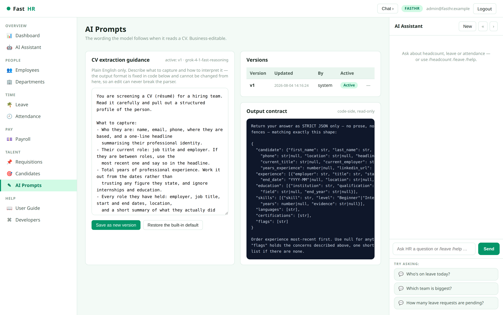
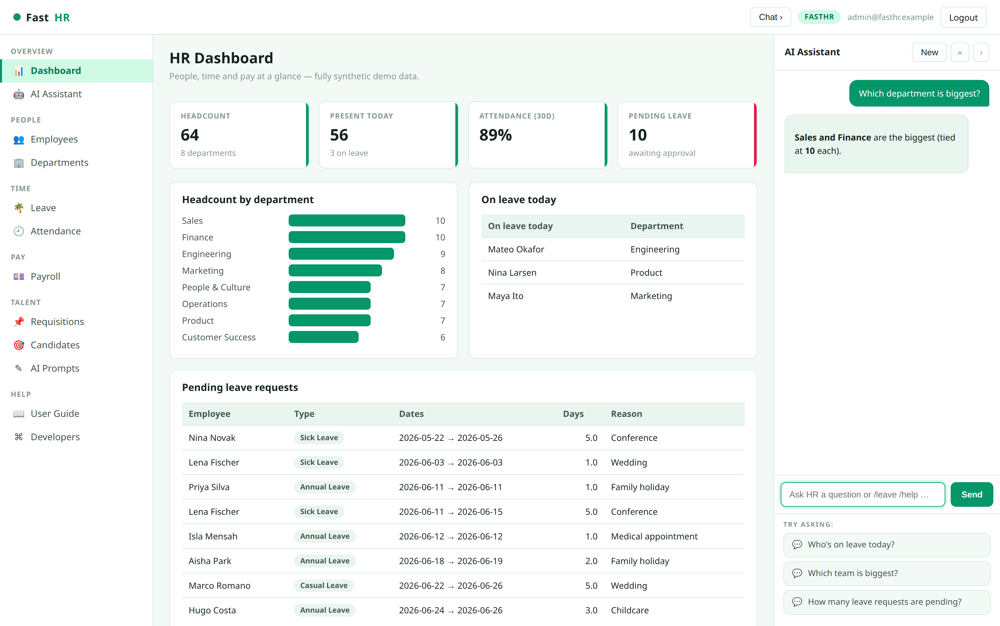

::: cover
# FastHRM

## User Guide

**People ops, without the spreadsheets.**

Employees · Leave & attendance · Payroll · Recruitment with AI CV screening

*All figures in this guide come from a demonstration dataset.*
:::

---

## Contents

| # | Section | What it covers |
|---|---|---|
| 1 | Signing in | Getting into your workspace |
| 2 | Dashboard | Your morning check: who's in, what needs approving |
| 3 | Employees | The directory, and what sits on a person's record |
| 4 | Employee record | Leave balance, attendance history, payslips |
| 5 | Departments | Headcount and salary cost per team |
| 6 | Leave | Approving and rejecting requests |
| 7 | Attendance | Today's register |
| 8 | Payroll | Pay runs by period |
| 9 | Payslip | The full breakdown for one person |
| 10 | Requisitions | Open roles and how they're tracked |
| 11 | Pipeline | Moving candidates through the hiring stages |
| 12 | Candidates | Your talent pool |
| 13 | Candidate profile | What the AI reads out of a CV |
| 14 | Adding a CV | Upload, and let the AI do the typing |
| 15 | AI prompts | Changing how the AI reads CVs |
| 16 | AI assistant | Asking questions in plain English |
| 17 | Weekly playbook | A suggested rhythm |

---

## 1 · Signing in

Go to your FastHRM address and sign in with your work email and password.

Your account decides what you can see once you're in. If you've forgotten your
password, use the reset link rather than asking a colleague to share theirs.

The demonstration workspace signs in as `admin@fasthr.example`.

---

## 2 · Dashboard

This is the page to open first thing. Four figures across the top: how many
people you employ, how many are in today, your attendance rate over the last 30
days, and how many leave requests are sitting unapproved.

Below that, headcount by department shows where your people actually are, and
**On leave today** tells you who to expect out of office.

The **Pending leave requests** list at the bottom is your worklist. If it's
empty, you're up to date.

---

## 3 · Employees

Everyone who works for you, searchable by name, email, job title or department.

Use the department buttons to narrow the list, or type in the search box to find
someone directly. The **Status** column separates people who are active from
those on leave or still in their probation period.

Click any name to open their record.

---

## 4 · Employee record

One page per person: their contact details, who they report to, when they
joined, and what they're paid.

**Leave balance** shows how many days they have left of each type — annual,
sick, casual and so on. **Recent attendance** is the coloured strip: one square
per day, so a pattern of absence is visible at a glance rather than buried in a
report. Hover a square to see the date.

Their payslips are listed underneath, most recent first.

---

## 5 · Departments

Each team with its headcount, who leads it, and what it costs in annual salary.

Useful when you're planning: it answers "how big is Engineering and what do we
spend on it" without exporting anything.

---

## 6 · Leave

Every leave request, filtered by status. **Pending** is the one that needs you.

Approve with the tick or reject with the cross. Approving a request
automatically deducts the days from that person's balance, and reversing an
approval puts them back — you never adjust balances by hand.

The form at the top lets you enter a request on someone's behalf, for when it
came to you by email or in person.

---

## 7 · Attendance

Today's register: who is present, who's working from home, who's on leave, on a
half day, or absent — with a count of each across the top and recorded hours per
person.

This is the page to check when someone asks whether a colleague is in.

---

## 8 · Payroll

Pay runs grouped by month. Pick a period from the buttons to see every payslip
in it, sorted by net pay, with the run total in the page heading.

---

## 9 · Payslip

One person, one month, fully itemised: gross pay, then income tax, pension and
any other deductions, down to net pay.

This is the view to open when someone queries their pay — every figure that
makes up the total is on one screen.

---

## 10 · Requisitions

Your open roles. Each requisition records how many people you're hiring, the
salary band, the location and working pattern, and who the hiring manager is.

The **Applicants** column shows live candidates against the total who ever
applied, so you can see at a glance which roles are attracting interest and
which need more sourcing. **Draft** roles aren't published yet and collect no
applicants.

The figures across the top summarise all your hiring at once.

---

## 11 · Pipeline

Open a requisition to see everyone applying for it. The bar across the top
counts candidates at each stage — Applied, Screen, Interview, Offer, Hired,
Rejected — and clicking a stage filters the list to it.

The **Move** button advances a candidate one stage; the cross rejects them.
Every move is recorded with who made it and when, so the history of a hire is
always reconstructable.

Click a name to open their profile.

---

## 12 · Candidates

Everybody you've ever considered, whether or not they're currently applying for
something. Search by name, job title or employer.

**Skills** counts what's been read out of their CV, and **CV parse** tells you
whether the AI has finished reading it. Someone with no application yet is still
here — this is your talent pool for the next opening.

---

## 13 · Candidate profile

Everything the AI read from the CV, laid out properly.

**Details** carries their contact information and current role. **Skills** lists
what they can do, with an experience level and the number of years behind each —
hover one to see where in the CV it came from. **Experience** is their career as
a timeline, most recent first, with dates tidied into a consistent format
whatever the CV used.

Education, applications and the original document sit on the right. Use
**Apply to requisition** to put them forward for a role.

---

## 14 · Adding a candidate from a CV

This is the part that saves the most time. Drop in a CV — PDF, Word or plain
text — choose which role it's for, and press **Upload & parse**.

The AI reads the document and fills in the candidate record for you: name,
contact details, current job, total years of experience, every role they've
held, their education and their skills. It takes about ten seconds, and the page
tells you when it's done.

It also flags things worth a second look — an unexplained gap, dates that
contradict each other, a qualification with no institution named.

You can always correct anything it got wrong, and your correction is kept: if
the same CV is read again, your edit stands.

---

## 15 · AI prompts

The instructions the AI follows when reading a CV are written in plain English,
and you can change them.

If it keeps missing something you care about — security clearances, say, or
notice periods — add a line asking for it. Press **Save as new version**, and
the next CV uploaded uses your wording.

Every version is kept and you can switch back to an earlier one at any time.
**Restore the built-in default** returns to the original wording.

The panel on the right is fixed and can't be edited. That's deliberate: it's
what guarantees your changes can't break anything, so you can experiment freely.

---

## 16 · AI assistant

The panel on the right answers questions about your own data, in plain English —
"which department is biggest", "who's on leave today", "how many requests are
pending".

There are shortcuts too: type `/headcount`, `/leave`, `/today` or `/payroll` for
an instant answer. These work even when the assistant is not connected to an AI
service.

Collapse the panel with the arrow when you want the full screen width.

---

## 17 · A weekly playbook

| When | Do this | Where |
|---|---|---|
| Every morning | Clear pending leave requests | Dashboard → Leave |
| Every morning | Check who's out today | Attendance |
| As CVs arrive | Upload and let the AI read them | Candidates → Upload & parse |
| Twice a week | Move candidates on, reject politely but promptly | Requisitions → pipeline |
| Weekly | Review roles with few applicants | Requisitions |
| Monthly | Check the pay run before it goes out | Payroll |
| Quarterly | Review headcount and cost per team | Departments |
| When it annoys you | Adjust what the AI pulls out of CVs | AI prompts |

Two habits make the rest easier: clear pending leave daily so it never becomes a
backlog, and upload CVs as they arrive rather than in batches — the AI does the
typing either way, but a current pipeline is a useful one.
