::: cover
# FastHRM

## User Guide

**People ops, without the spreadsheets.**

Employees · Time & pay · Public careers · Recruiting automation · Performance

*All figures in this guide come from a demonstration dataset.*
:::

---

## Contents

| # | Section | What it covers |
|---|---|---|
| 1 | Signing in | Getting into your workspace |
| 2 | Dashboard | Your morning check: who's in, what needs approving |
| 3 | Employees | The directory, and what sits on a person's record |
| 4 | Employee record | Leave balance, attendance history, payslips |
| 5 | Departments | Headcount and salary cost per team |
| 6 | Leave | Approving and rejecting requests |
| 7 | Attendance | Today's register |
| 8 | Payroll | Pay runs by period |
| 9 | Payslip | The full breakdown for one person |
| 10 | Requisitions | Open roles and how they're tracked |
| 11 | Pipeline | Moving candidates through the hiring stages |
| 12 | Candidates | Your talent pool |
| 13 | Candidate profile | What the AI reads out of a CV |
| 14 | Adding a CV | Upload, and let the AI do the typing |
| 15 | Offers | Making, approving and accepting an offer |
| 16 | Talent analytics | Funnel, sources, speed and interviewer load |
| 17 | Public careers | Branded careers discovery |
| 18 | Job pages | Shareable role specs and candidate applications |
| 19 | Recruiting operations | Projects, tasks, templates, CRM and talent pools |
| 20 | Workflow board | Visual pipelines, forms, approvals and publication |
| 21 | Communications | Mailboxes, templates, automation, privacy and surveys |
| 22 | Scheduling | Availability and candidate self-scheduling |
| 23 | Marketing | Job boards, campaigns, page templates and webhooks |
| 24 | Recruiting analytics | Funnel, source, conversion and recruiter reporting |
| 25 | Enterprise controls | Brands, SSO, access policy, AI screening and support |
| 26 | Goals & OKRs | Cascading objectives and check-ins |
| 27 | Feedback | Praise, coaching and peer review |
| 28 | Review cycles | Running an appraisal round |
| 29 | Performance signals | Explainable attrition and promotion indicators |
| 30 | Onboarding | The new-hire checklist |
| 31 | Internal changes | Promotions and transfers, with approval |
| 32 | Separations | Notice, handover and exit interview |
| 33 | Employee relations | Confidential case handling |
| 34 | Org chart | Reporting lines and headcount planning |
| 35 | Integrations | Connecting external HR services |
| 36 | AI prompts | Changing how the AI reads CVs |
| 37 | AI assistant | Asking questions in plain English |
| 38 | Weekly playbook | A suggested rhythm |

---

## 1 · Signing in

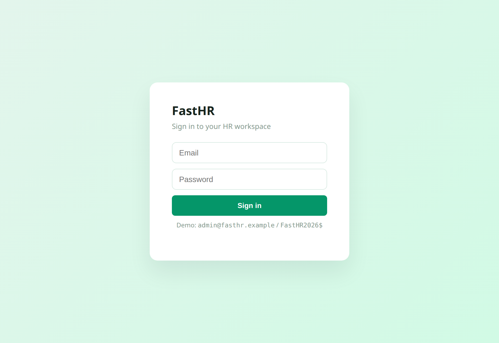

Go to your FastHRM address and continue with Google, or sign in with your work
email and password. New users can register from the same panel; verified Google
accounts are created on first sign-in.

Your account decides what you can see once you're in. If you've forgotten your
password, use the reset link rather than asking a colleague to share theirs.
After signing in from a feature link, FastHRM returns you to that feature.

The demonstration workspace signs in as `admin@fasthr.example`.

---

## 2 · Dashboard

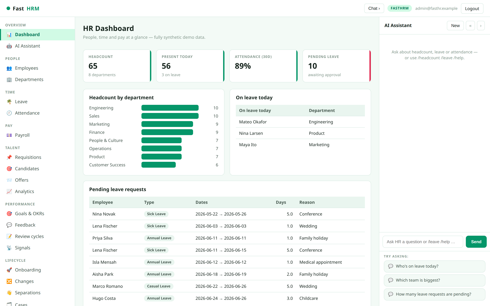

This is the page to open first thing. Four figures across the top: how many
people you employ, how many are in today, your attendance rate over the last 30
days, and how many leave requests are sitting unapproved.

Below that, headcount by department shows where your people actually are, and
**On leave today** tells you who to expect out of office.

The **Pending leave requests** list at the bottom is your worklist. If it's
empty, you're up to date.

---

## 3 · Employees

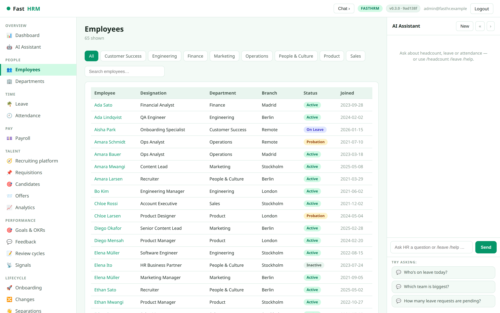

Everyone who works for you, searchable by name, email, job title or department.

Use the department buttons to narrow the list, or type in the search box to find
someone directly. The **Status** column separates people who are active from
those on leave or still in their probation period.

Click any name to open their record.

---

## 4 · Employee record

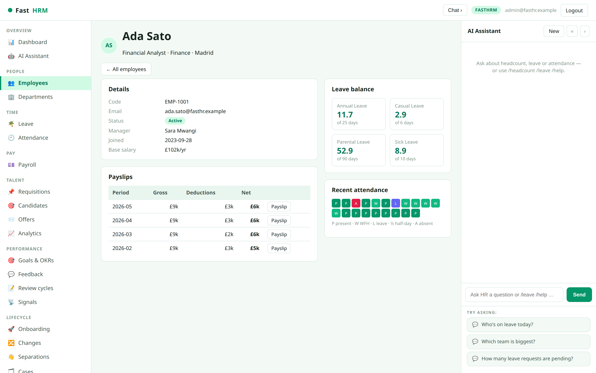

One page per person: their contact details, who they report to, when they
joined, and what they're paid.

**Leave balance** shows how many days they have left of each type — annual,
sick, casual and so on. **Recent attendance** is the coloured strip: one square
per day, so a pattern of absence is visible at a glance rather than buried in a
report. Hover a square to see the date.

Their payslips are listed underneath, most recent first.

---

## 5 · Departments

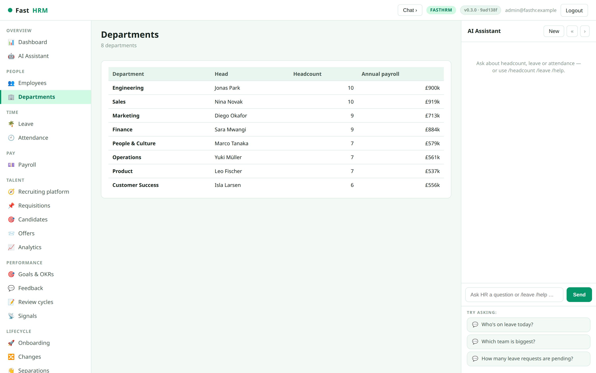

Each team with its headcount, who leads it, and what it costs in annual salary.

Useful when you're planning: it answers "how big is Engineering and what do we
spend on it" without exporting anything.

---

## 6 · Leave

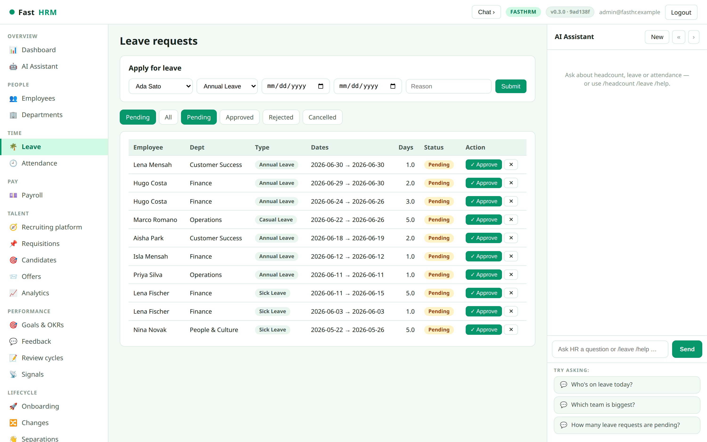

Every leave request, filtered by status. **Pending** is the one that needs you.

Approve with the tick or reject with the cross. Approving a request
automatically deducts the days from that person's balance, and reversing an
approval puts them back — you never adjust balances by hand.

The form at the top lets you enter a request on someone's behalf, for when it
came to you by email or in person.

---

## 7 · Attendance

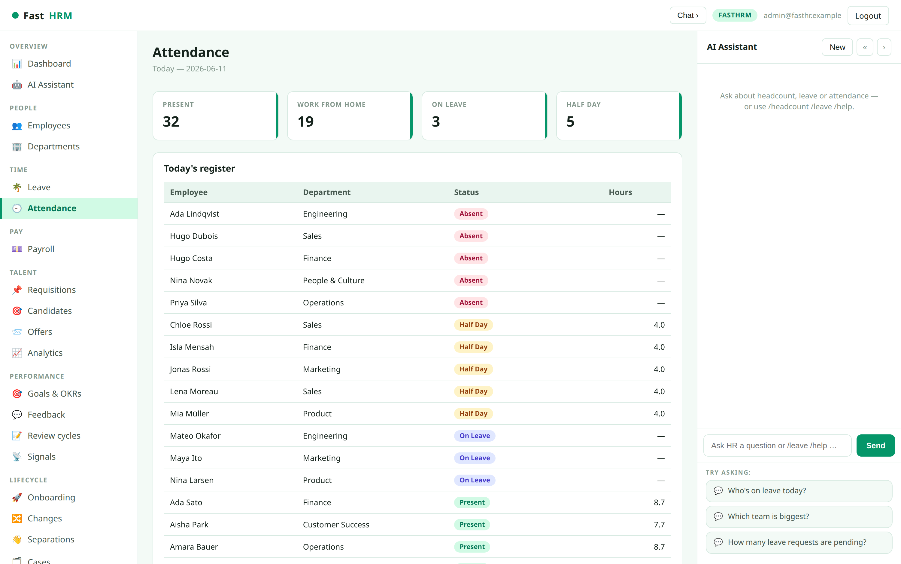

Today's register: who is present, who's working from home, who's on leave, on a
half day, or absent — with a count of each across the top and recorded hours per
person.

This is the page to check when someone asks whether a colleague is in.

---

## 8 · Payroll

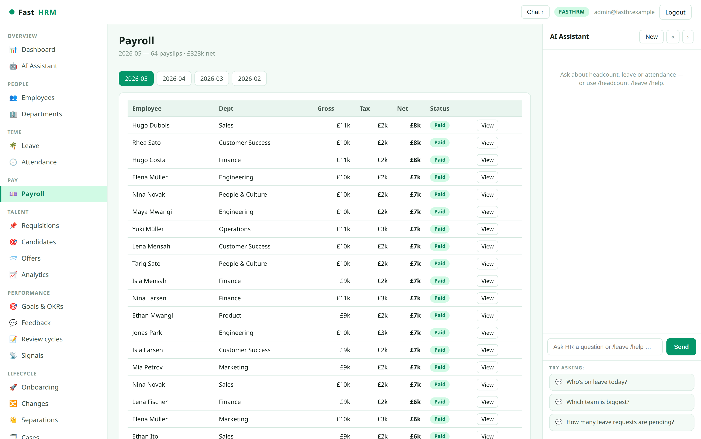

Pay runs grouped by month. Pick a period from the buttons to see every payslip
in it, sorted by net pay, with the run total in the page heading.

---

## 9 · Payslip

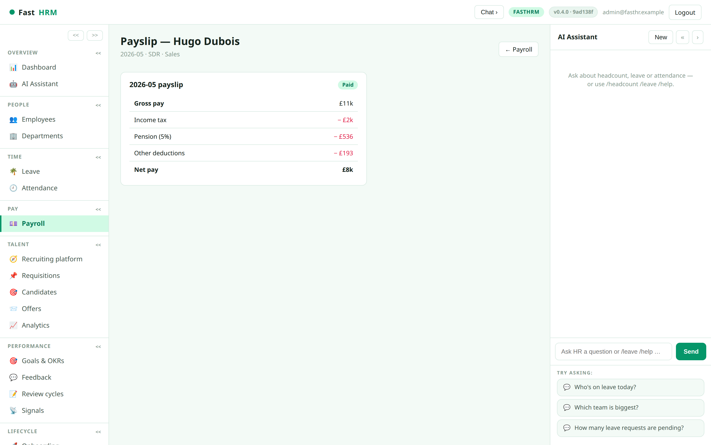

One person, one month, fully itemised: gross pay, then income tax, pension and
any other deductions, down to net pay.

This is the view to open when someone queries their pay — every figure that
makes up the total is on one screen.

---

## 10 · Requisitions

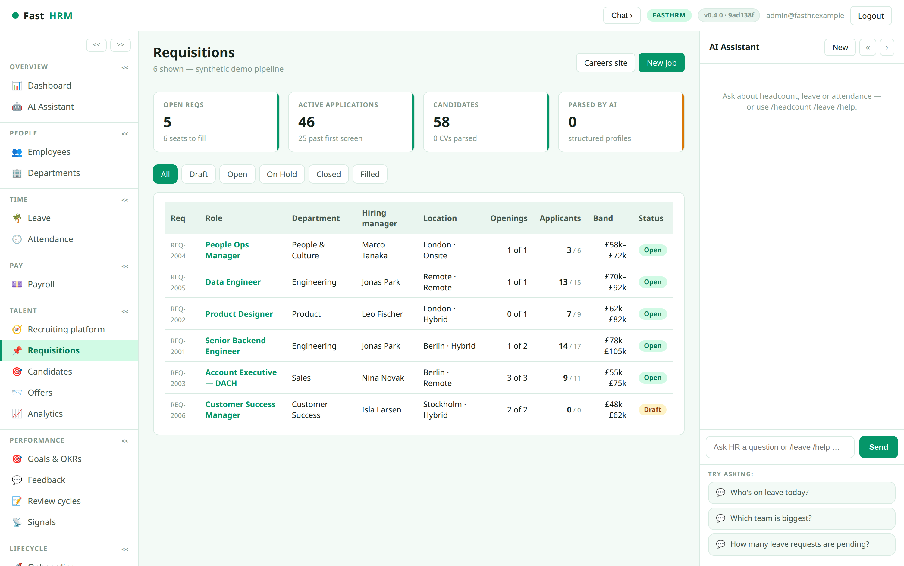

Your open roles. Each requisition records how many people you're hiring, the
salary band, the location and working pattern, and who the hiring manager is.

The **Applicants** column shows live candidates against the total who ever
applied, so you can see at a glance which roles are attracting interest and
which need more sourcing. **Draft** roles aren't published yet and collect no
applicants.

The figures across the top summarise all your hiring at once.

---

## 11 · Pipeline

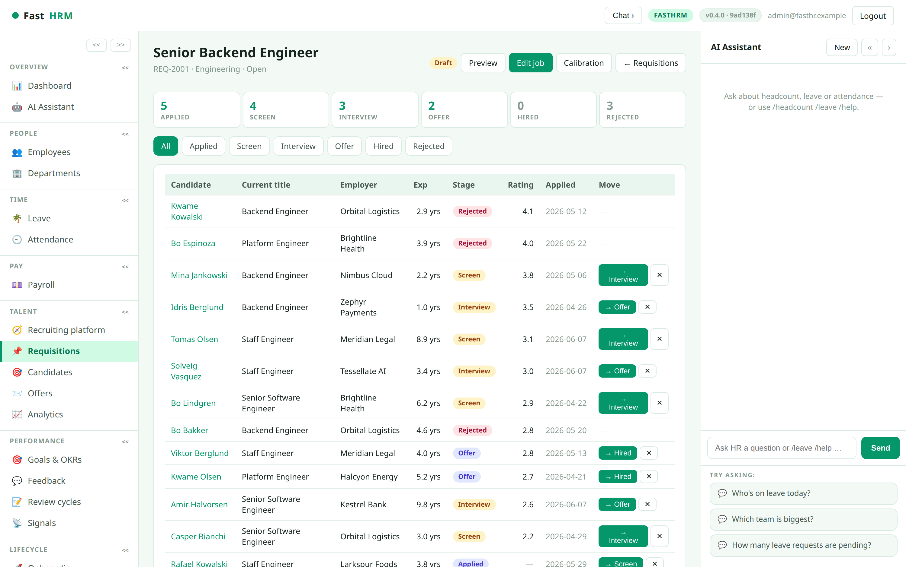

Open a requisition to see everyone applying for it. The bar across the top
counts candidates at each stage — Applied, Screen, Interview, Offer, Hired,
Rejected — and clicking a stage filters the list to it.

The **Move** button advances a candidate one stage; the cross rejects them.
Every move is recorded with who made it and when, so the history of a hire is
always reconstructable.

Click a name to open their profile.

---

## 12 · Candidates

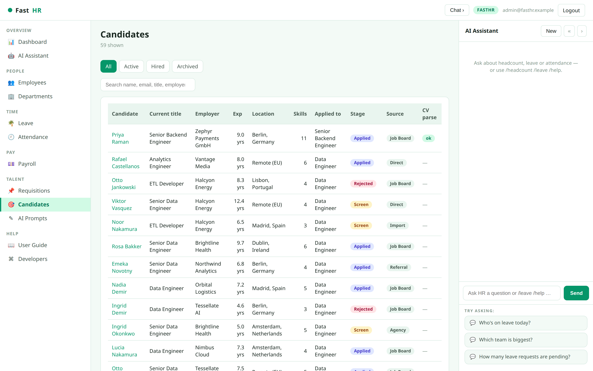

Everybody you've ever considered, whether or not they're currently applying for
something. Search by name, job title or employer.

**Skills** counts what's been read out of their CV, and **CV parse** tells you
whether the AI has finished reading it. Someone with no application yet is still
here — this is your talent pool for the next opening.

---

## 13 · Candidate profile

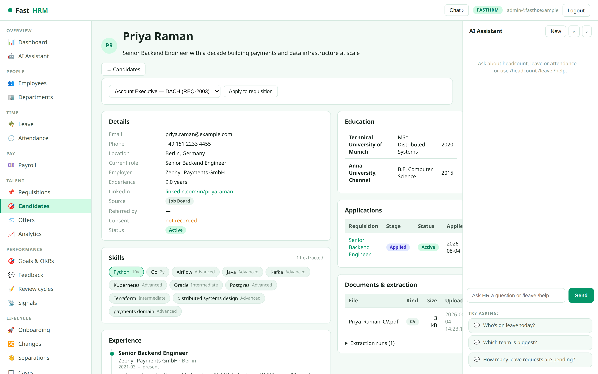

Everything the AI read from the CV, laid out properly.

**Details** carries their contact information and current role. **Skills** lists
what they can do, with an experience level and the number of years behind each —
hover one to see where in the CV it came from. **Experience** is their career as
a timeline, most recent first, with dates tidied into a consistent format
whatever the CV used.

Education, applications and the original document sit on the right. Use
**Apply to requisition** to put them forward for a role.

---

## 14 · Adding a candidate from a CV

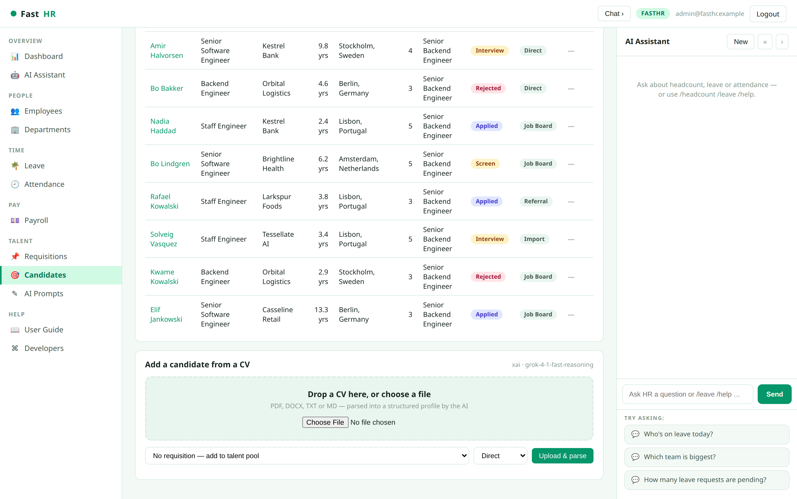

This is the part that saves the most time. Drop in a CV — PDF, Word or plain
text — choose which role it's for, and press **Upload & parse**.

The AI reads the document and fills in the candidate record for you: name,
contact details, current job, total years of experience, every role they've
held, their education and their skills. It takes about ten seconds, and the page
tells you when it's done.

It also flags things worth a second look — an unexplained gap, dates that
contradict each other, a qualification with no institution named.

You can always correct anything it got wrong, and your correction is kept: if
the same CV is read again, your edit stands.

---

## 15 · Offers

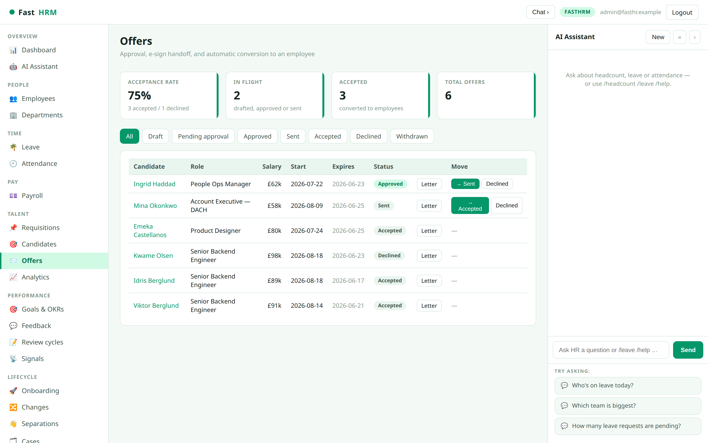

When you've decided, draft the offer from the candidate's profile: salary, start
date and an expiry. The letter is written for you and can be edited.

An offer moves through drafting, approval, sending and acceptance, and each step
is recorded. **Accepting an offer creates the employee record automatically** —
their details, skills and leave allowance carry across, and the onboarding
checklist starts itself. You never retype a hire.

---

## 16 · Talent analytics

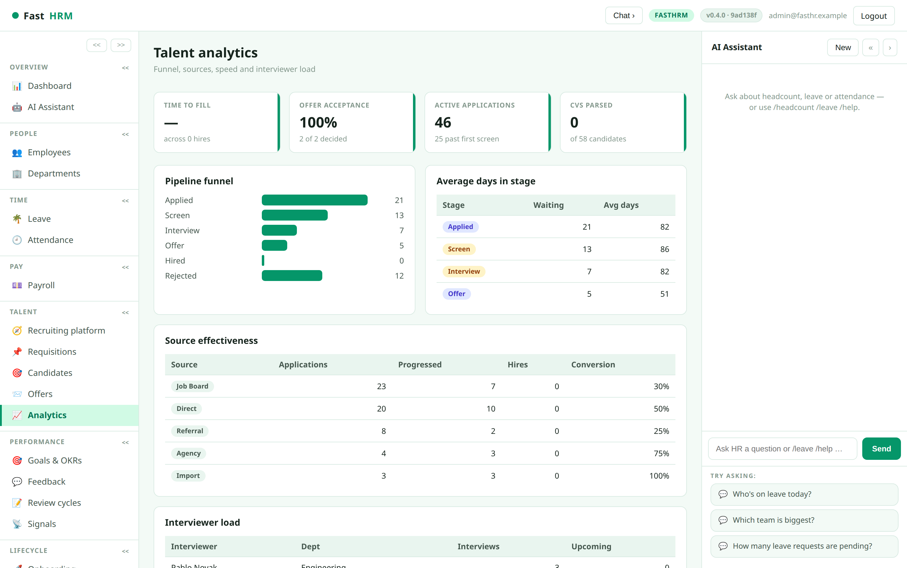

How your hiring is actually performing: how long roles take to fill, which
sources produce candidates who progress, where people sit waiting in the
pipeline, and how interview work is spread across the team.

The stage timings are the ones worth watching. Candidates waiting a long time at
one stage is usually a process problem, not a candidate problem.

---

## 17 · Public careers site

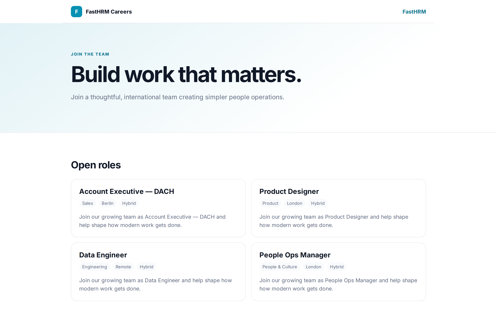

Published requisitions appear automatically on the branded careers site. Each
role has its own shareable sub-page with the public title, location, working
pattern, description, requirements and an application form.

---

## 18 · Job pages and applications

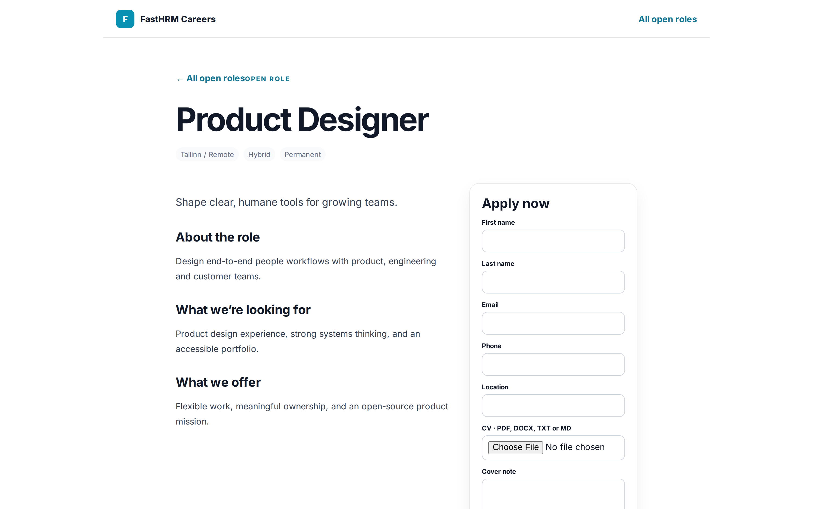

Candidates apply without signing in. FastHRM records their answers and consent,
deduplicates repeat submissions, and adds the application to the correct
pipeline. Edit and preview a job before publishing; closing it removes the
public page without deleting its history.

---

## 19 · Recruiting operations

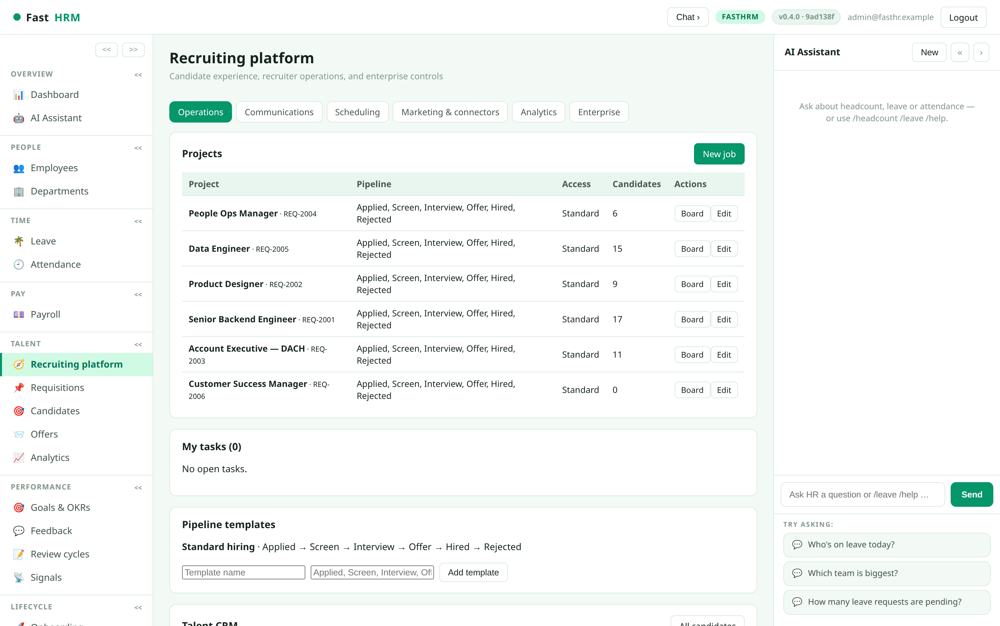

The **Operations** tab is the recruiter's daily workspace: projects, personal
tasks, reusable pipeline templates, saved candidate searches, automatic talent
pools and audited bulk actions. Use a talent pool to keep warm candidates
grouped by skill, tag, source or location, then send a targeted job invitation.

---

## 20 · Workflow board

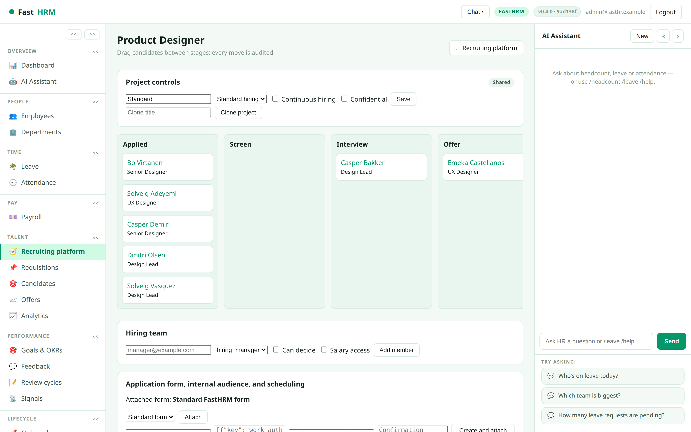

Each project has a visual stage board. Move a candidate between columns to
advance the application; every change is written to the audit history. The same
workspace configures the hiring team, application form, scorecard, approvals,
internal vacancy and scheduled publish or close date.

---

## 21 · Communications and automation

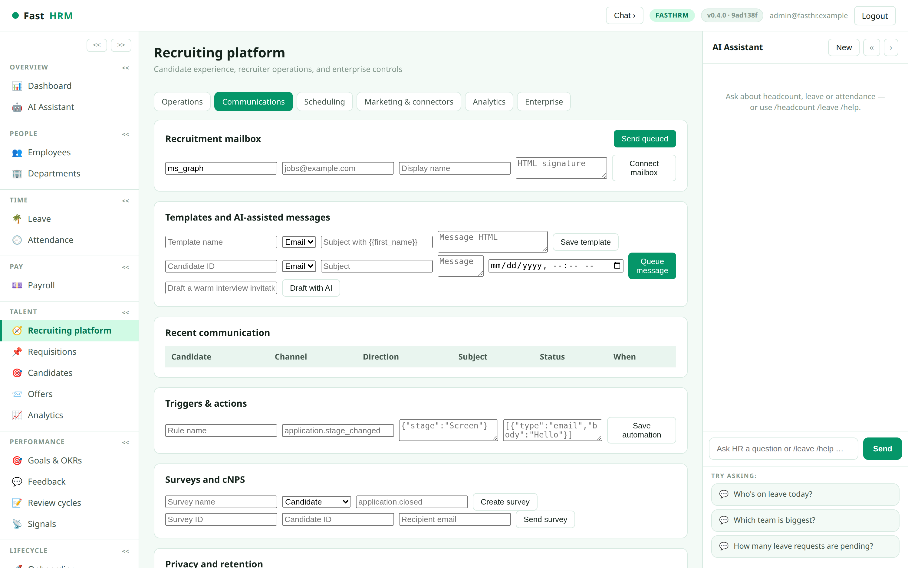

Connect a recruitment mailbox to keep inbound and outbound messages with the
candidate record. Templates support candidate and job fields; messages can be
queued for email or SMS and scheduled for later.

Automation rules react to events such as a stage change and can create a task,
add a tag or send a message. This tab also manages candidate-experience surveys,
consent retention and privacy export, anonymisation or deletion requests.

---

## 22 · Interview scheduling

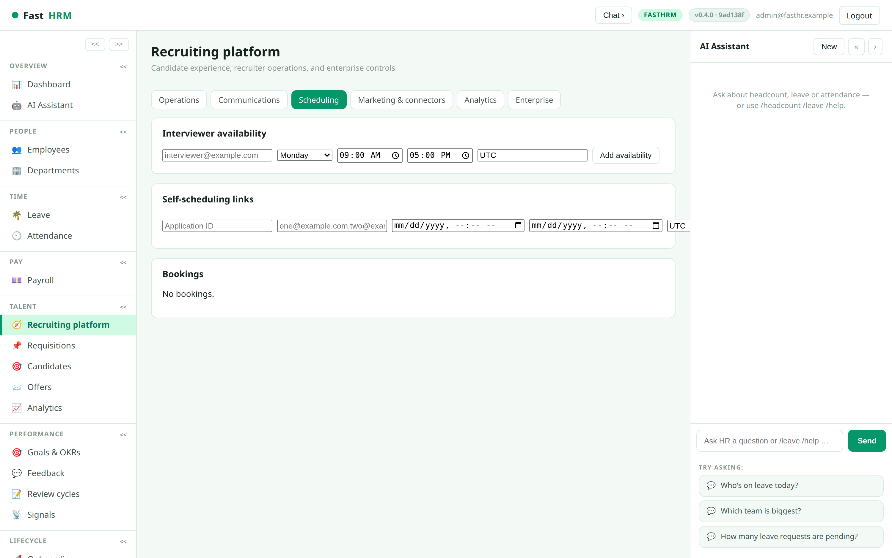

Record each interviewer's recurring availability, then send a candidate a
self-scheduling link for an allowed date window. FastHRM offers only mutually
available slots and creates the selected FastHRM, Teams or Google Meet booking.
Cancelled bookings remain auditable and release the slot.

---

## 23 · Marketing and connectors

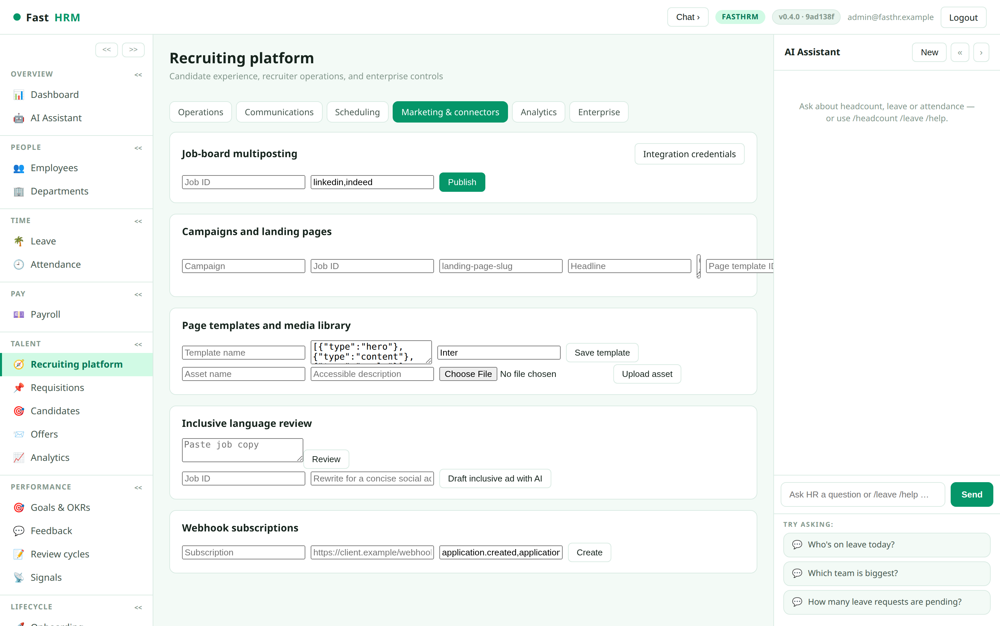

Publish a role to supported job boards and keep the external posting status in
one place. Campaign landing pages combine reusable sections, brand styles and a
media library; inclusive-language review catches avoidable wording before copy
is published.

Connector accounts synchronize external events, while signed webhook
subscriptions send application updates to downstream systems with delivery and
retry history.

---

## 24 · Recruiting analytics

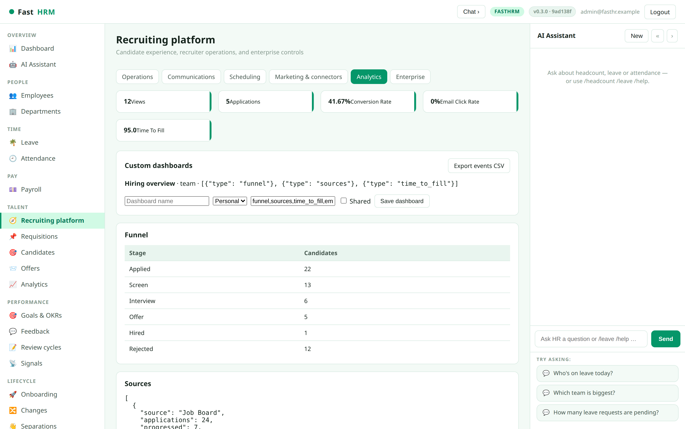

Track job views, applications, conversion, email engagement and time to fill.
The funnel and source views show where candidates arrive and where they stop;
recruiter activity and hires are reported from the same audit trail.

Save personal, team or group dashboards, export events to CSV, and run stable
A/B experiments on public job copy without losing attribution.

---

## 25 · Enterprise controls

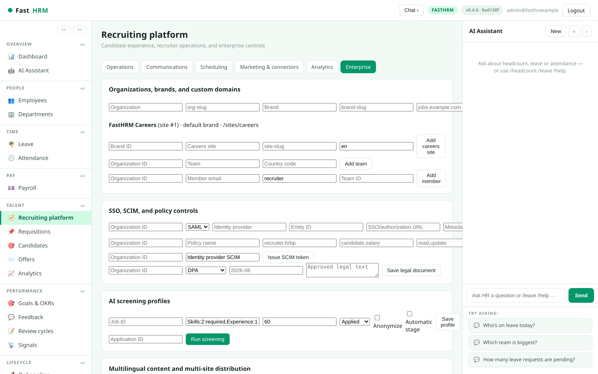

Enterprise workspaces can separate organisations, brands, careers sites, teams,
countries and custom domains. SAML or OIDC sign-in, SCIM provisioning, role and
resource policies, legal-document acceptance and localization provide the
administrative boundary around recruiting data.

This area also holds weighted and anonymised AI screening profiles, asynchronous
video interviews, multilingual job distribution, candidate import and sourcing,
and support plans with response and resolution SLAs. Treat automatic screening
as a recommendation: required criteria, evidence and human overrides remain
visible.

---

## 26 · Goals & OKRs

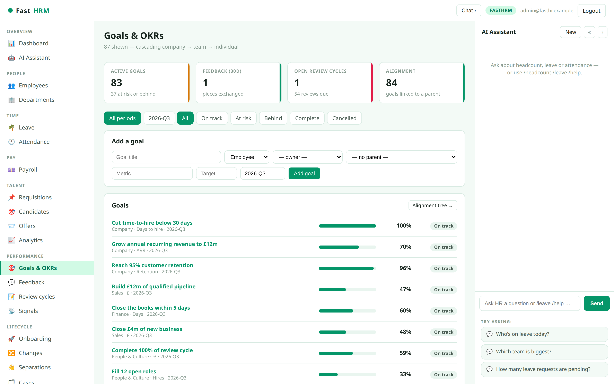

Objectives at three levels: company, team and individual. Each goal has a
metric, a target and a period, and shows progress against it.

Link a goal to a parent to show how it contributes. The **Alignment** view then
draws the whole cascade, so anyone can see how their work ladders up.

Check in on a goal to update its progress. Every check-in is kept, so you can
see whether something drifted gradually or stalled all at once.

---

## 27 · Feedback

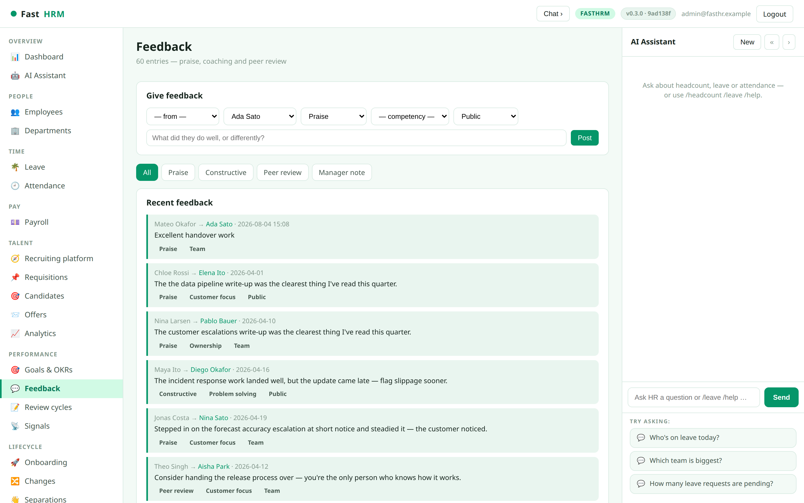

Continuous feedback rather than an annual surprise: praise, coaching notes and
peer review, optionally tagged to a competency.

Visibility is set per entry — public, team-only, or private to the manager. Use
private for anything that needs care, and public for praise, which is worth more
when others can see it.

---

## 28 · Review cycles

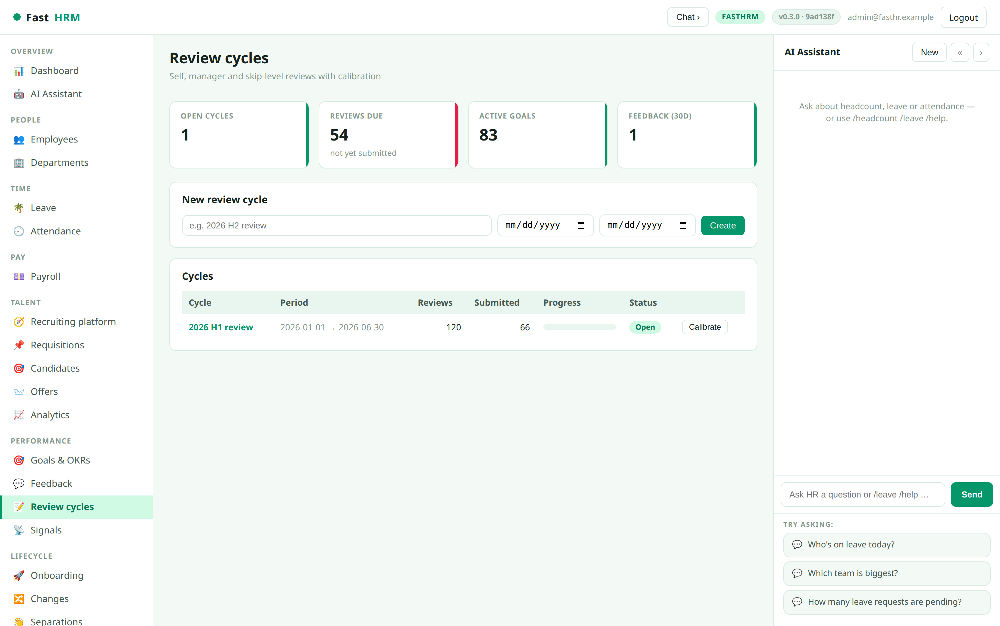

Create a cycle for the period you're reviewing, then open it. Opening generates
a self review and a manager review for everyone automatically — you don't create
them one at a time.

As reviews come in, the cycle view shows the distribution of ratings and the
average by department. That's your calibration conversation: if one team rates
everyone a four and another rates nobody above three, the difference is usually
the manager, not the people.

---

## 29 · Performance signals

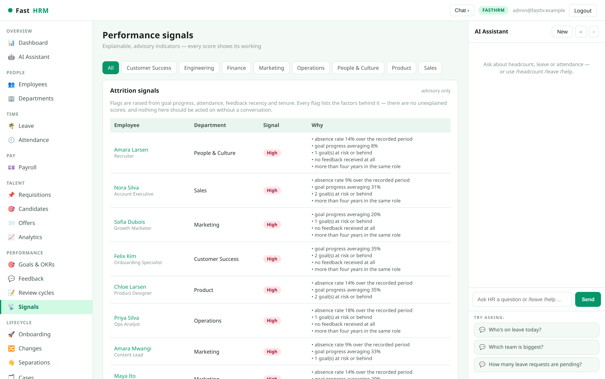

Advisory indicators drawn from goal progress, attendance, feedback and tenure —
who may be disengaging, and who looks ready for more.

**Every flag lists the reasons behind it.** There are no unexplained scores, and
nothing here is a verdict. Treat a flag as a prompt to have a conversation, and
check the reasons before you do — some of them will have an obvious innocent
explanation you already know about.

---

## 30 · Onboarding

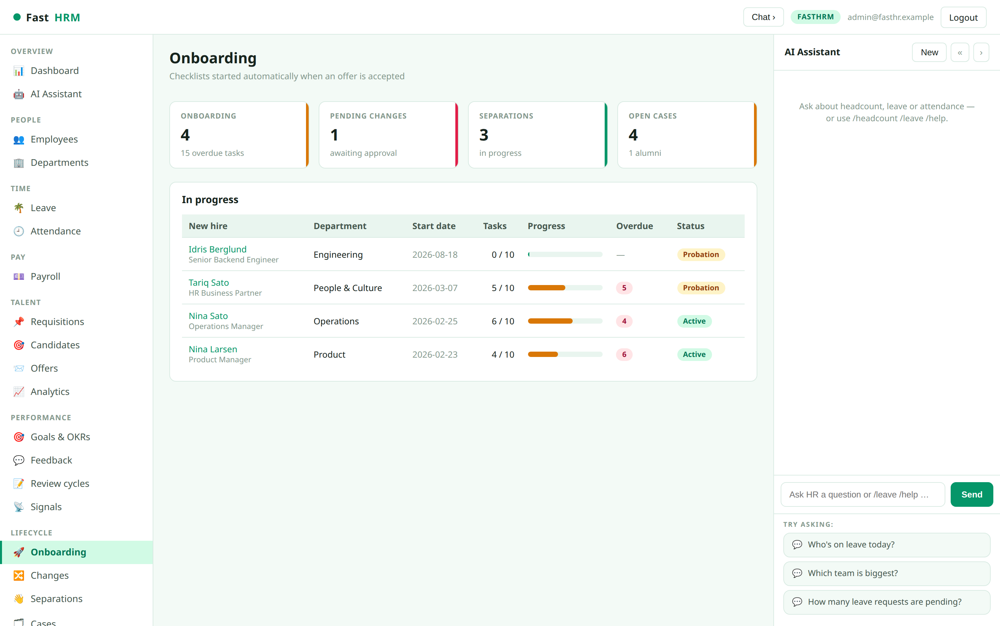

Every new hire gets a checklist covering contracts, equipment, accounts, a buddy
and their first check-ins, with each task owned by HR, the manager, IT or the new
starter themselves.

Overdue tasks are flagged in red. The board shows everyone currently onboarding
at once, so nothing quietly stalls at "order the laptop".

---

## 31 · Internal changes

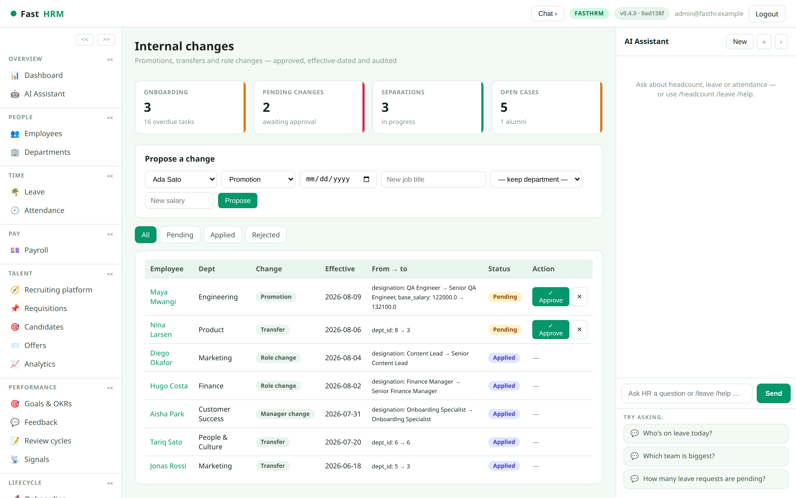

Promotions, transfers, role changes and pay changes are proposed here with an
effective date, then approved.

Nothing is written to the employee record until it's approved, and the before
and after values are both kept. That means you can always answer "what was their
title in March", which matters more often than you'd think.

---

## 32 · Separations

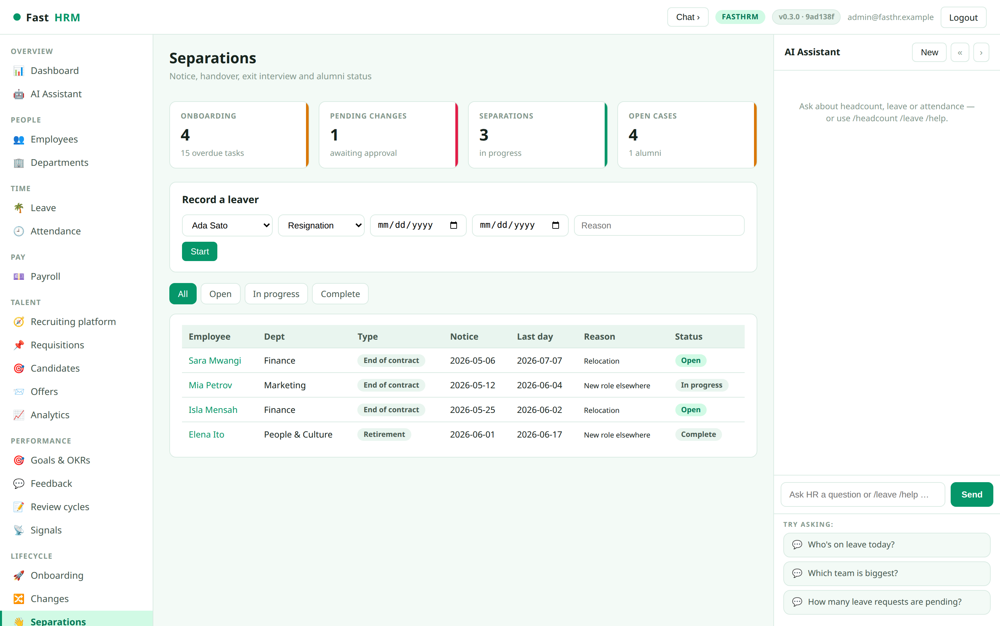

When someone resigns or leaves, record it here: notice date, last day and reason.

An offboarding checklist covers handover, equipment, access and the final
payslip. Completing it marks the person as inactive and moves them to **Alumni** —
former colleagues are the cheapest source of a good hire, so they're kept rather
than deleted.

The exit interview is recorded alongside, with a sentiment so patterns across
leavers are visible.

---

## 33 · Employee relations

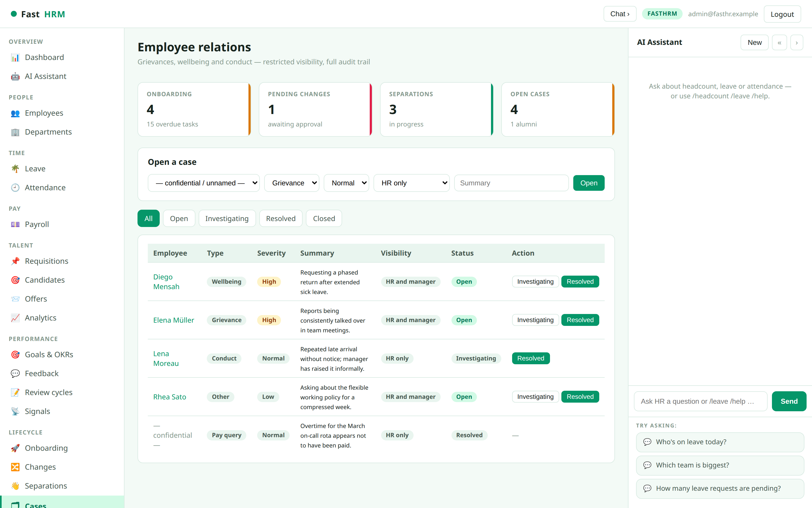

Grievances, wellbeing requests, conduct issues and pay queries, tracked with a
severity and a restricted visibility.

A case can be opened without naming the person where that's appropriate.
Everything is audit-logged — which protects both the employee and you.

---

## 34 · Org chart

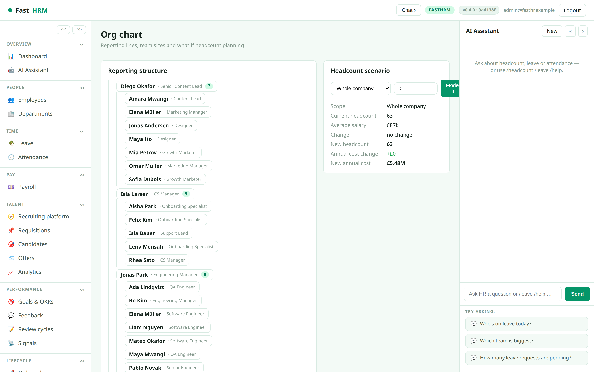

Reporting lines drawn from who reports to whom, with team sizes rolled up.

Alongside it, headcount planning: pick a team, add or remove people, and see what
it does to annual salary cost at that team's current average. Useful for budget
conversations before they become commitments.

---

## 35 · Integrations

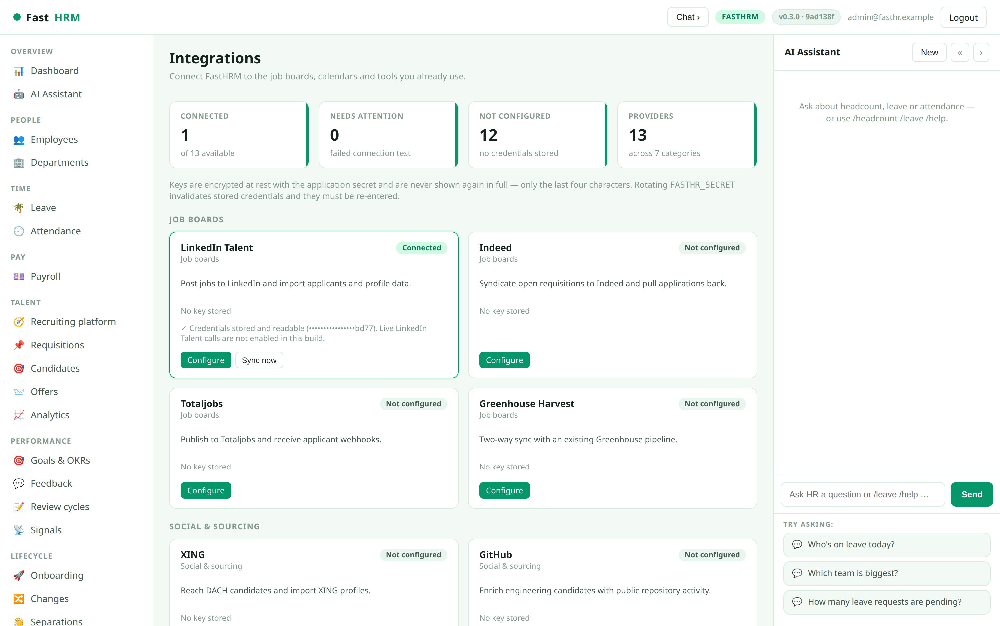

Connect FastHRM to the services you already use: LinkedIn, Indeed and other job
boards, calendars for interview scheduling, Slack or Teams for notifications,
e-signature for offers, and background screening.

Enter the API key the provider gives you and press **Test**. Keys are encrypted
before they're stored and are never shown again in full — only the last four
characters — so a screen-share can't leak one.

**Disconnect** erases the stored credentials entirely rather than just hiding
them.

---

## 36 · AI prompts

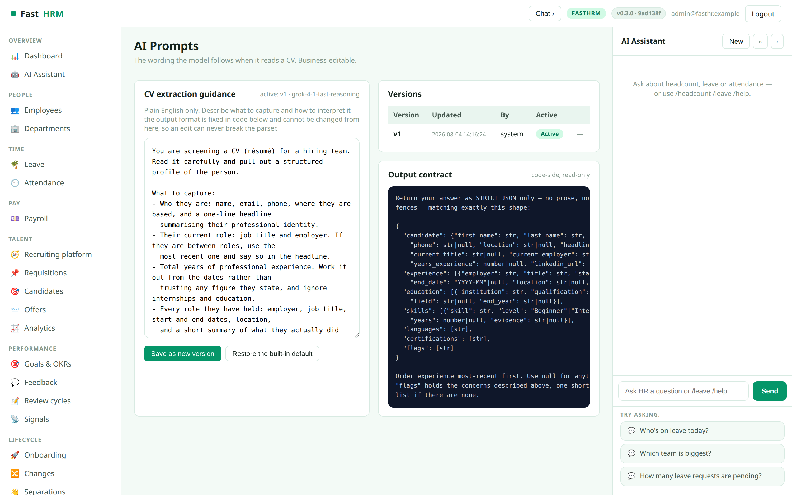

The instructions the AI follows when reading a CV are written in plain English,
and you can change them.

If it keeps missing something you care about — security clearances, say, or
notice periods — add a line asking for it. Press **Save as new version**, and
the next CV uploaded uses your wording.

Every version is kept and you can switch back to an earlier one at any time.
**Restore the built-in default** returns to the original wording.

The panel on the right is fixed and can't be edited. That's deliberate: it's
what guarantees your changes can't break anything, so you can experiment freely.

---

## 37 · AI assistant

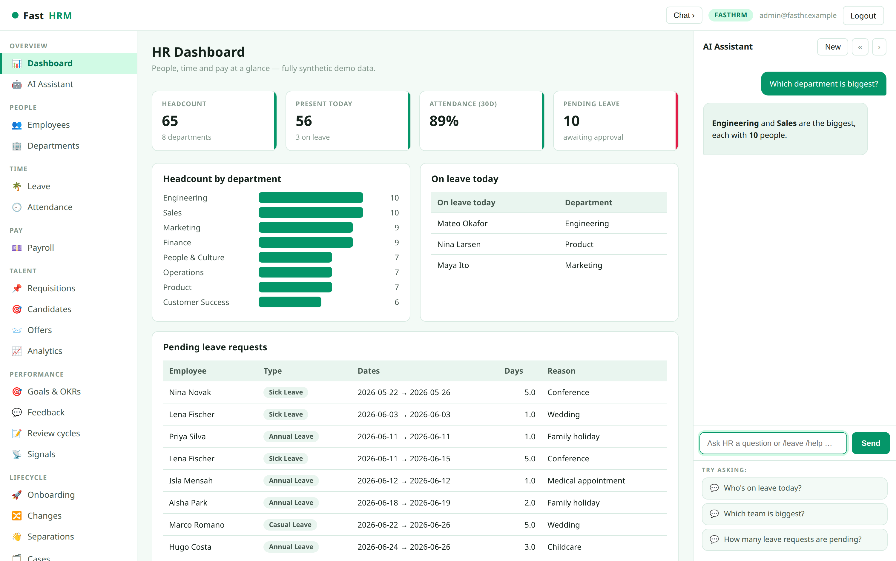

The panel on the right answers questions about your own data, in plain English —
"which department is biggest", "who's on leave today", "how many requests are
pending".

There are shortcuts too: type `/headcount`, `/leave`, `/today` or `/payroll` for
an instant answer. These work even when the assistant is not connected to an AI
service.

Collapse the panel with the arrow when you want the full screen width.

---

## 38 · A weekly playbook

| When | Do this | Where |
|---|---|---|
| Every morning | Clear pending leave requests | Dashboard → Leave |
| Every morning | Check who's out today | Attendance |
| As CVs arrive | Upload and let the AI read them | Candidates → Upload & parse |
| Twice a week | Move candidates on, reject politely but promptly | Requisitions → pipeline |
| Weekly | Review roles with few applicants | Requisitions |
| Weekly | Clear recruiter tasks and refresh talent pools | Recruiting platform → Operations |
| Weekly | Check queued messages, privacy requests and automation runs | Recruiting platform → Communications |
| Weekly | Review self-scheduling links and interview load | Recruiting platform → Scheduling |
| Monthly | Compare funnel conversion and source quality | Recruiting platform → Analytics |
| Monthly | Check the pay run before it goes out | Payroll |
| Quarterly | Review headcount and cost per team | Departments |
| As offers go out | Chase acceptance before expiry | Offers |
| Weekly | Check onboarding for overdue tasks | Onboarding |
| Weekly | Clear pending internal changes | Changes |
| Fortnightly | Review goals showing at risk | Goals & OKRs |
| Monthly | Read the performance signals, then talk to people | Signals |
| Quarterly | Run the review cycle and calibrate | Review cycles |
| When it annoys you | Adjust what the AI pulls out of CVs | AI prompts |

Two habits make the rest easier: clear pending leave daily so it never becomes a
backlog, and keep applications moving while conversations are fresh. Upload CVs
as they arrive, schedule the next action, and let automations handle predictable
follow-up without hiding the human decision.
