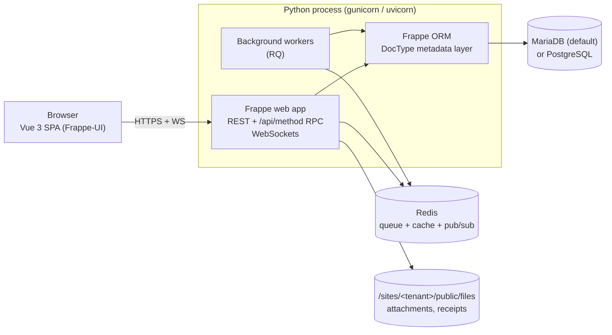
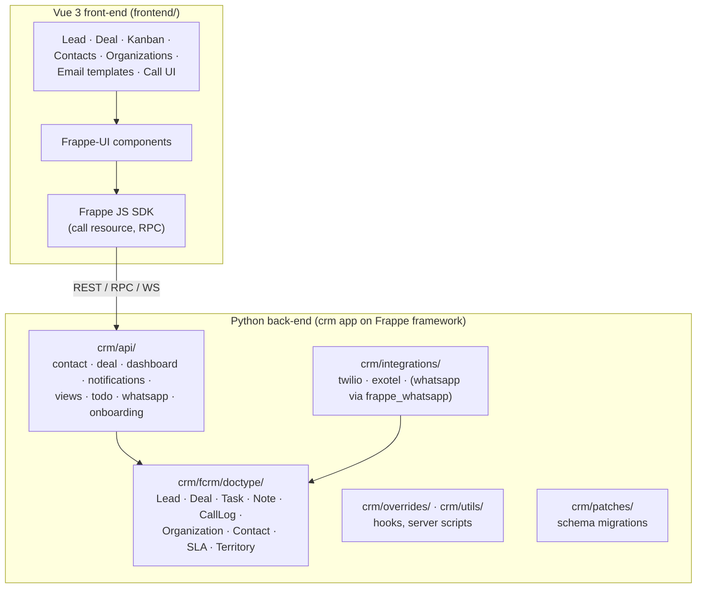
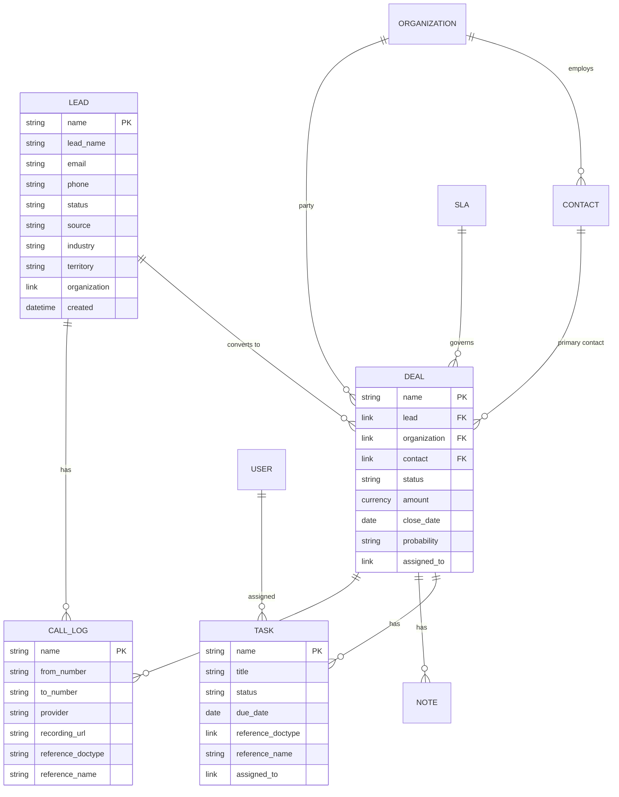
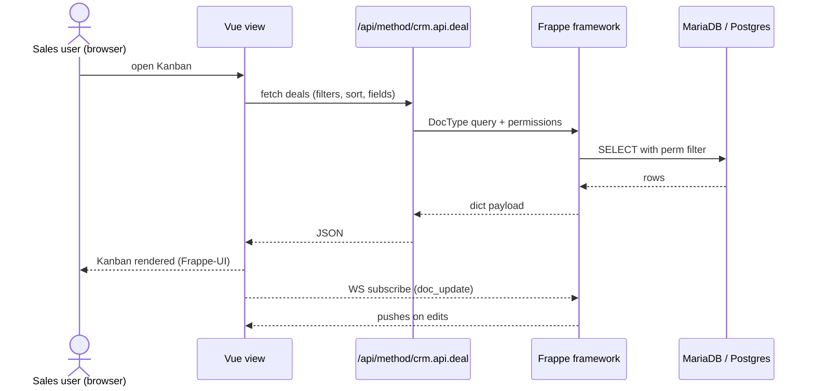
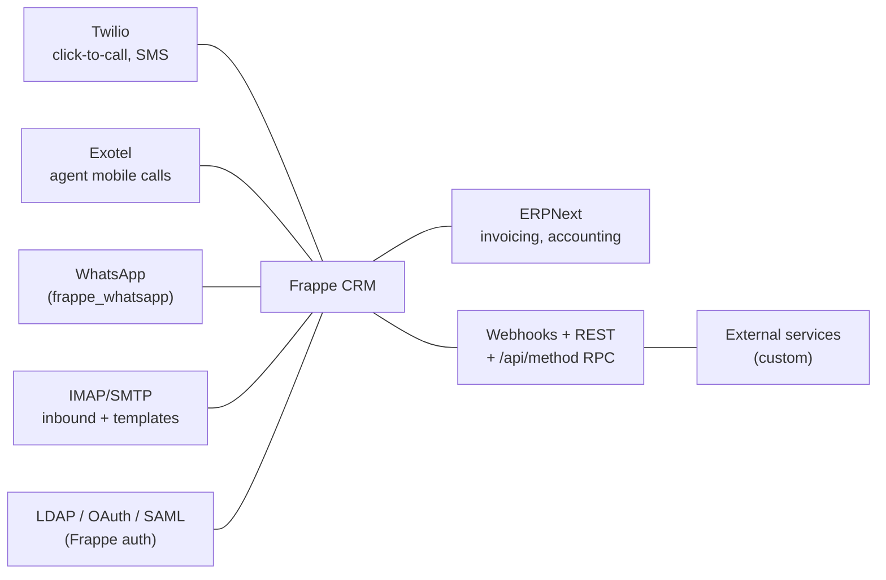
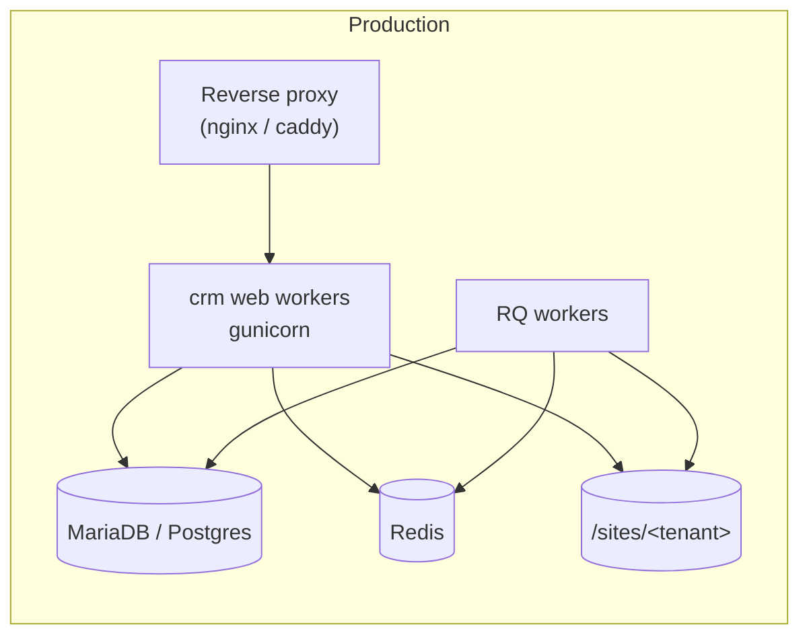

# Reference architecture — Frappe-shaped CRM (Python back-end, Vue front-end)

This is the architectural shape that a Frappe-CRM-style deployment takes: a
Python back-end built on the Frappe framework, a Vue 3 / Frappe-UI front-end,
MariaDB (or Postgres) for the site database, Redis for queues and cache, and
site-per-tenant isolation. It is the reference stack assumed throughout the
rest of this review.

## Runtime topology

## Module layout (Frappe CRM shape)

## DocType-driven functional model

## Request lifecycle (typical CRM read)

## Integration surface

## Deployment shape

## Design properties that matter for an enterprise

1. **Metadata-driven extension.** Adding a new object is a DocType (JSON);
   permissions are data; workflows are data; reports are data. Customisation
   survives version upgrades.
2. **Site-per-tenant isolation.** Each customer / business unit can be its own
   site with its own DB — clean data-residency story.
3. **Python-typed back-end, thin JS front-end.** Boring, readable,
   inspectable. No 200 MB `node_modules` on the server.
4. **Built-in job queue, websockets, permissions, file store.** You don't
   reinvent these per integration.
5. **Open licence (AGPL-3) + self-host.** Exit cost is a database export and a
   Docker image.
