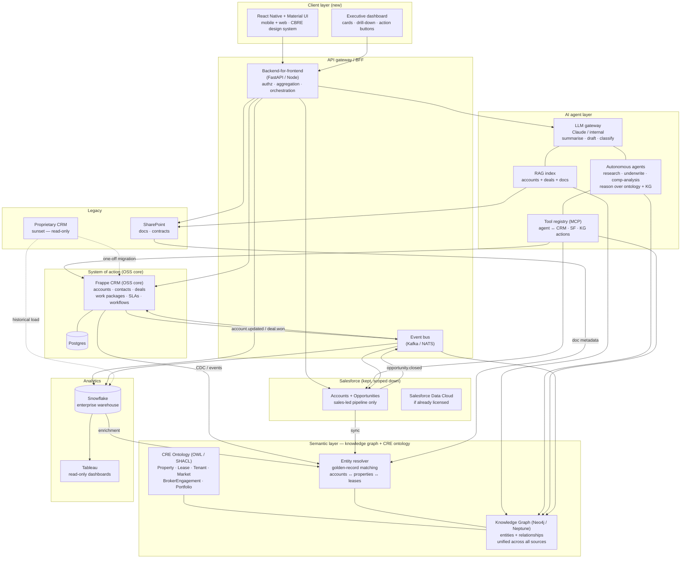

# Open-source CRM / project-management stacks — comparison & CBRE target architecture

**Audience:** CBRE architecture review (Michael Palys).
**Question:** should Salesforce come in and rebuild account + CRM + project
management, or is there a faster, cheaper, less-lock-in path using open-source
building blocks?

---

## 1. The three OSS reference repos

| | [Frappe CRM](https://github.com/frappe/crm) | [Plane](https://github.com/makeplane/plane) | [OpenProject](https://github.com/opf/openproject) |
|---|---|---|---|
| **Primary language** | Python (Frappe framework) + Vue 3 (Frappe-UI) | TypeScript (Next.js) + Django (Python API) | Ruby on Rails + Angular |
| **Domain** | Sales CRM — leads, deals, pipelines, calls, tasks | Project / issue management (Jira-like) | Project / portfolio / budgets / Gantt |
| **Licence** | AGPL-3 | AGPL-3 (with Enterprise tier) | GPL-3 (Enterprise add-ons) |
| **Maturity** | Young, shipping fast, sits on the mature Frappe framework | New (2023+), fast-moving, modern UX | Mature (since ~2011), battle-tested in public sector |
| **Stack shape** | Frappe monolith, site-per-tenant, Vue 3 front-end | SPA front, REST/GraphQL back, Docker heavy | Rails monolith + Angular front-end |
| **Extensibility** | **Metadata-driven DocTypes, server/client scripts, hooks** — add objects without forking | Code forks; plugin system immature | Ruby plugins; requires Rails fluency |
| **Multi-tenant** | **Sites-per-tenant, each with its own DB** | Workspaces inside one DB | Typically single-tenant per install |
| **Integration surface** | REST + `/api/method` RPC + WebSockets + webhooks + Python hooks + RQ queue | REST + webhooks | REST + webhooks; SAML / LDAP strong |
| **Ops footprint** | Python + MariaDB/Postgres + Redis + Node (build only) | Node + Python + Postgres + Redis + Minio | Ruby + Postgres + Memcached + (optional) ElasticSearch |
| **What it's best at** | **Sales CRM you can extend without forking — closest infra match for enterprise CRM** | Modern UI, issue tracking, sprint boards | Work package hierarchies, Gantt, compliance |
| **What it's weak at** | UI is functional rather than beautiful; Frappe conventions have a learning curve | Not a CRM; custom objects are limited | Old Angular front-end; SPA feel lags modern tools |

### Language commentary — pragmatic, not ideological

All three ship real product. The question is not "Python vs TypeScript vs
Ruby" — it is **whether the framework lets you add a new object type, wire a
workflow, and integrate an external system without forking the repo.** On
that axis Frappe wins. It is explicitly metadata-driven: DocTypes, workflows,
permissions, reports and print formats are data, not code. Customisation
survives upgrades.

---

## 2. Frappe CRM — what it actually is (functional + integration view)

Studying the repo (`github.com/frappe/crm`) the surface breaks down like this.

### Core functional objects (`crm/fcrm/doctype/`)

| DocType | Purpose |
|---|---|
| `crm_lead` | Top-of-funnel capture — lead name, source, status, owner |
| `crm_deal` | Pipeline opportunity — stage, amount, close date, probability |
| `crm_organization` | Account / company record |
| `crm_contacts` | Person record, linked to organizations & deals |
| `crm_task` | Work item, assignable, reference any other DocType |
| `fcrm_note` | Rich notes attached to leads / deals |
| `crm_call_log` | Telephony activity (inbound/outbound, recording URL) |
| `crm_telephony_agent` / `crm_telephony_phone` | Agent + line configuration |
| `crm_service_level_agreement` / `_priority` / `_rolling_response_time` | Full SLA engine with priorities and rolling response-time tracking |
| `crm_territory` / `crm_industry` / `crm_lead_source` / `crm_lost_reason` | Sales taxonomies |
| `crm_fields_layout` / `crm_view_settings` | Per-user custom layouts & views |
| `crm_form_script` | Client-side scripting attached to forms |
| `crm_dashboard` / `crm_notification` | Dashboards + in-app notifications |
| `crm_status_change_log` | Audit trail on status transitions |

### Functional capabilities (from the README and source)

- **Unified Lead / Deal page** — activities, comments, notes, tasks, emails, calls collapsed into one screen.
- **Kanban view** — drag-and-drop across stages.
- **Custom views** — user-defined filters, sorts, columns (`crm_view_settings`).
- **Email templates + send/receive** via Frappe's IMAP/SMTP integration.
- **Telephony UI** — click-to-call, call popup, recording playback.
- **WhatsApp UI** inside the deal page.
- **SLA engine** — service levels, priority, rolling response-time metrics.
- **Assignment rules** (`crm/api/assignment_rule.py`) — auto-assign leads.
- **Lead-syncing** (`crm/lead_syncing/`) — inbound pipelines from external sources.
- **Dashboards + onboarding flows** (`crm/api/dashboard.py`, `crm/api/onboarding.py`).

### Integrations that ship in-box (`crm/integrations/`)

| Integration | Purpose |
|---|---|
| **Twilio** | Voice + SMS, click-to-call, call recording |
| **Exotel** | Indian telephony provider — agent-mobile calls via app |
| **WhatsApp** (via `frappe_whatsapp`) | Two-way WhatsApp messages on the deal page |
| **ERPNext** | Upstream ERP — invoices, accounting, products (same Frappe framework) |
| **Email (IMAP/SMTP)** | Inbound email threading + outbound templates |
| **Webhooks + REST + RPC** | Every DocType is a REST resource; `/api/method/*` gives RPC |
| **Auth: LDAP / OAuth / SAML** | Inherited from Frappe framework |

### Why this matters for a CBRE-scale deployment

- You can add **"Property"**, **"Listing"**, **"BrokerEngagement"** as
  DocTypes in an afternoon — fields, permissions, list/form layouts all
  metadata. No fork.
- Each business unit or region can be its own **site** (independent DB, file
  store, users). This is a clean answer to data-residency and blast-radius
  questions.
- The integration layer (Twilio / Exotel / WhatsApp / ERPNext) is the pattern
  you'd extend with **Salesforce-sync**, **SharePoint-sync**, **Tableau read
  model**, **LLM gateway** — each is a `crm/integrations/<vendor>` folder plus
  a DocType for settings.
- AGPL-3 on a self-hosted monolith means exit cost ≈ DB export. No per-seat
  ceiling, no vendor roadmap risk.

---

## 3. Why open source beats a Salesforce-led rebuild for an enterprise

The frame is not "free vs paid". It is **who owns the extension point.**

### The Atlassian lesson

Atlassian built a multi-billion-dollar company by being the extensible
substrate inside every other enterprise: Jira, Confluence, Bitbucket.
Customers accepted the footprint because they trusted the extension surface
(plugins, REST, webhooks, marketplace) was stable.

When Atlassian forced the **Server → Cloud** migration in 2021–2024, that
trust broke. Enterprises discovered they had:

- no way to keep running the software they had licensed;
- no clean migration for heavily customised installs;
- per-seat pricing scaling against headcount, not value;
- a roadmap decided in Sydney, not in their CIO's office.

That is the same shape as a Salesforce-heavy CRM estate today, just slower.
Salesforce is not evil — it is a well-run SaaS optimising for its own
multiples. Its incentives diverge from yours on:

- data-egress cost,
- AI feature packaging (every new AI capability lands as a new SKU),
- sandbox and storage limits at scale,
- admin-tier licence inflation,
- what happens when you want to take the **workflow AND the data** elsewhere.

### What OSS changes

- **You own the source, so you own the upgrade cadence.** Security and legal can read everything in production.
- **The data model is your schema.** When AI moves value up the stack (Claude / internal models over your account data), you apply it where the data lives.
- **Extensions are code you wrote**, not apps you rent — no marketplace-churn tax.
- **Exit cost ≈ cost of moving a Postgres / MariaDB database**, not a re-platform.

OSS is **not always cheaper in year one** — licence spend is replaced by
engineering. It is almost always cheaper across years two to five, and
dramatically cheaper the year you want to change vendor, model, or host.

---

## 4. CBRE — target state

### Where you are today

- **Tableau** front-ends layered on **SharePoint** — good to *see*, bad to *act*.
- A **proprietary CRM / project tool** underneath. Old, isolated, a single point of institutional risk.
- Tableau and the proprietary CRM **don't talk to each other**.
- **Salesforce gravity** is real in the estate — sales and finance trust it.
- Design ambition: **React-Native + Material UI** based on the new CBRE design system.

### The three functional needs, mapped to the architecture

| Need | What it really is | Where it lives |
|---|---|---|
| Executive dashboards — "see the business, kick off work" | Read-model + action API (write-back) | React-Native client + BFF aggregation (not Tableau) |
| Account maintenance | System-of-record for accounts, hierarchies, contracts | **Frappe-shaped OSS core** (Frappe CRM, informed by best-in-class CRE SaaS such as Enaia) |
| CRM / project management | Pipelines, deals, work packages, timelines | OSS core; Salesforce kept but scoped to pipeline only |

### Target architecture

### Why this shape specifically

1. **OSS core is the system of record** for accounts, projects, workflows. That is the durable asset — a Postgres schema you own.
2. **Salesforce stays, but scoped** to opportunities, quoting, forecasting. Accounts are mastered in the OSS core and synced to SF; SF becomes a consumer, not the master.
3. **A thin BFF + event bus** is the integration surface. Every new consumer — React-Native app, dashboards, AI agents — talks to the BFF, not to Salesforce or the OSS core directly. This is what lets you swap or upgrade the OSS core later without touching the client.
4. **Tableau goes read-only** and is fed from the event bus / warehouse. It stops being the front door. The "system of action" is the new React-Native UI calling the BFF.
5. **AI is applied to data you own** — single LLM gateway, RAG over accounts + deals + SharePoint. Not per-seat Einstein SKUs.

### Semantic layer — the knowledge graph and CRE ontology

The architecture introduces a **semantic layer** between the operational systems and the AI agents. This is the single most important structural decision for AI readiness.

**Why a knowledge graph, not just a warehouse.**  Snowflake stores facts as rows. A knowledge graph stores facts *and their relationships* — "Account A holds Lease B on Property C in Market D managed by Broker E". That graph structure is what lets an AI agent traverse context instead of issuing sequential SQL queries. For a commercial real-estate business, the entity graph *is* the business.

**The CRE ontology (OWL / SHACL)** formally defines the domain vocabulary:

| Ontology class | What it represents | Key relationships |
|---|---|---|
| `cre:Property` | Physical asset — building, floor, unit | hasLease, inMarket, managedBy |
| `cre:Lease` | Contractual tenancy | hasTenant, onProperty, hasTerm |
| `cre:Tenant` | Occupier entity | holdsLease, linkedAccount |
| `cre:Market` | Geographic / sector market | containsProperty, hasComps |
| `cre:BrokerEngagement` | Advisory mandate | forAccount, onProperty, assignedBroker |
| `cre:Portfolio` | Grouped set of properties | containsProperty, ownedBy |
| `cre:Comp` | Comparable transaction | inMarket, forPropertyType, atPrice |

This ontology is machine-readable — AI agents can introspect it to understand what entities exist, what actions are valid, and what relationships to traverse. When you add a new concept (e.g. `cre:Sublease`), every agent automatically knows how to reason about it.

**Entity resolver** performs golden-record matching across CRM, Salesforce, SharePoint, and Snowflake. "CBRE Global Investors", "CBRE GI", and Salesforce Account #00341 resolve to one node in the graph. This is the prerequisite for any AI agent that needs to answer questions spanning multiple systems.

### AI agents — why ontology future-proofs them

The previous architecture had a single LLM gateway doing summarise/draft/classify. The new architecture adds **autonomous agents** that can:

- **Research**: "Pull all lease expirations in the next 18 months for Portfolio X, find comparable transactions in those markets, and draft a renewal strategy." The agent traverses the knowledge graph, not individual APIs.
- **Underwrite**: "Given this property and market comps, score the deal." The agent reads the ontology to know what a comp is, queries the KG for relevant nodes, and reasons over them.
- **Comp analysis**: "Find the five most relevant comparables for this lease." Graph traversal over `cre:Comp` → `cre:Market` → `cre:PropertyType`.

**Tool registry (MCP)** gives agents structured access to write-back into the CRM, update Salesforce, or annotate the knowledge graph. Agents don't get raw database access — they get ontology-typed actions.

**Why this is future-proof**: when the next generation of AI capabilities arrives (planning, multi-step reasoning, tool composition), the ontology and knowledge graph are already there. You don't restructure data — you give new agents the same graph and better models. The ontology is the stable contract between your data and whatever AI runs on top of it.

### Sequencing — integration pattern first, then build

You do not decide the full stack on day one. You decide the **integration pattern** on day one (BFF + event bus + ontology), then build the OSS core incrementally — learning from best-in-class specialist CRE SaaS (such as Enaia) for domain-specific UX, workflows, and data models, while keeping the core open-source and under your control.

| Phase | Weeks | What ships |
|---|---|---|
| 0. Foundations | 0–4 | BFF skeleton, event bus, SSO, CBRE design-system components. Read-only adapter to Salesforce. |
| 1. Executive dashboard | 4–10 | First React-Native screen backed by BFF. Reads from Salesforce + proprietary CRM. One "kick off workflow" action. Proves the system-of-action pattern with zero replatform risk. |
| 2. OSS core pilot | 8–16 | **Frappe CRM pilot** against a scoped business unit (not sales-critical). Same BFF contract. Benchmark features against specialist CRE SaaS (e.g. Enaia) for domain UX and workflows. Score on: speed of new object type, admin ergonomics, upgrade cadence, cost model. |
| 3. CRE customisation | 16–20 | Build CRE-specific DocTypes (Property, Lease, BrokerEngagement) informed by specialist SaaS feature sets. Validate against real user workflows. |
| 4. Account mastering + ontology | 18–30 | Accounts mastered in OSS core. Salesforce becomes a consumer. **CRE ontology v1** (Property, Lease, Tenant, Market). Entity resolver wired to CRM + SF + SharePoint. Knowledge graph seeded from existing data. |
| 5. AI agents + knowledge graph | 30–42 | RAG switched from flat index to knowledge-graph traversal. First autonomous agents: comp analysis, lease-expiration alerts, account research. Tool registry (MCP) for agent write-back. |
| 6. Full workflow + scale | 42–52 | Full work-package / project-management move into OSS core. Ontology extended (Sublease, Disposition, CapEx). Tableau reduced to analytics-only. Multi-agent orchestration for complex workflows. |

### What NOT to do

- **Don't let Salesforce lead a greenfield rebuild** of account + project management. 12–18 months, seven figures, tighter lock-in exactly as AI rearranges vendor economics.
- **Don't go "fully custom composable platform" on day one.** Accounts, permissions, workflow, reports from scratch is how enterprises generate multi-year unfinished programmes. Use Frappe CRM as the OSS substrate for the 80% that is undifferentiated, and study specialist CRE SaaS (e.g. Enaia) for the 20% of domain UX that matters.
- **Don't treat Tableau as the action layer.** Tableau is a read model. Forcing it to be a system of action is why nothing talks to anything today.
- **Don't skip the knowledge graph.** The ontology is what makes AI agents useful — without it, you get summarisation, not reasoning.
- **Don't skip the event bus.** It is the piece that makes every later swap cheap.

### The summary line

> Keep Salesforce for pipeline. Move accounts and projects onto a Frappe CRM
> open-source core — learning domain-specific features from best-in-class CRE
> SaaS like Enaia, but keeping the code and data under your control. Put a BFF,
> event bus, and knowledge graph between systems. Layer a CRE ontology so AI
> agents can reason over the full entity graph, not just search documents.
> React-Native Material UI on top. Tableau goes read-only. The proprietary CRM
> gets sunset over 12 months. Exit cost at any future point is a Postgres
> export + a portable ontology.

---

*Author: Michael Palys — Predictive Labs review for CBRE.*
